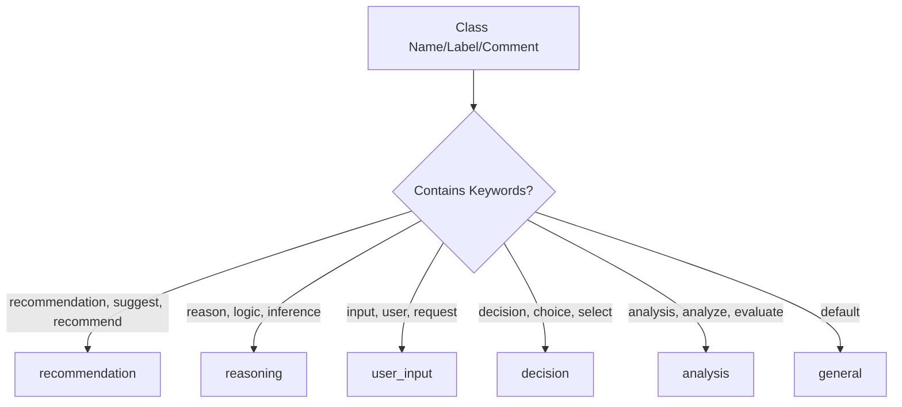
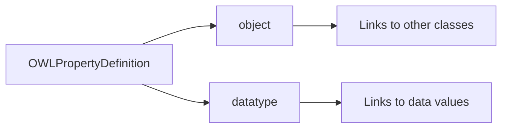
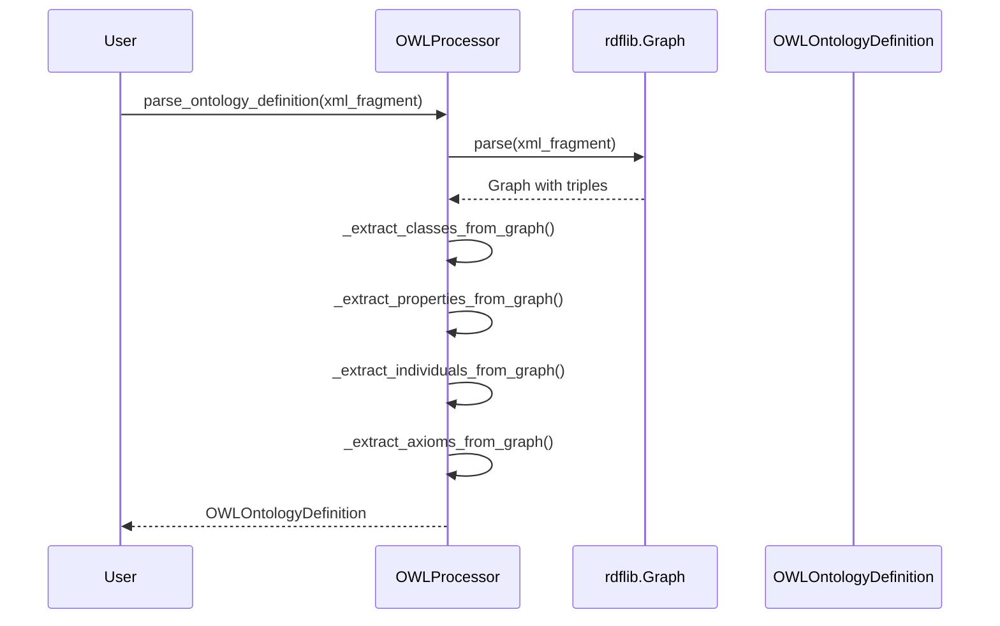
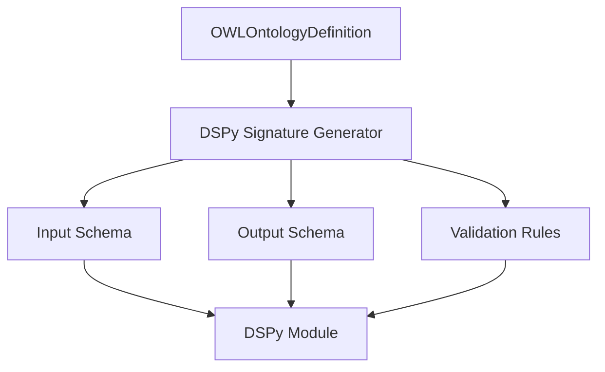

# OWL Processor Data Structures

This document shows the data structures generated by the OWLProcessor for DSPy signature generation and ontology management.

## Data Structure Overview

```mermaid
classDiagram
    class OWLOntologyDefinition {
        +str ontology_uri
        +str prefix
        +str namespace
        +str label
        +str comment
        +Dict[str, OWLClassDefinition] classes
        +Dict[str, OWLPropertyDefinition] object_properties
        +Dict[str, OWLPropertyDefinition] data_properties
        +Dict[str, OWLIndividualDefinition] individuals
        +List[Dict[str, Any]] axioms
    }

    class OWLClassDefinition {
        +str uri
        +str name
        +str label
        +str comment
        +str semantic_type
        +List[str] properties
        +List[str] superclasses
        +List[Dict[str, Any]] restrictions
    }

    class OWLPropertyDefinition {
        +str uri
        +str name
        +str label
        +str comment
        +str property_type
        +Optional[str] domain
        +Optional[str] range
        +Optional[str] cardinality
    }

    class OWLIndividualDefinition {
        +str uri
        +str name
        +str label
        +str comment
        +List[str] class_types
        +Dict[str, List[str]] property_values
    }

    class OWLProcessor {
        +parse(xml_fragment: str) Graph
        +parse_ontology_definition(xml_fragment: str, ontology_name: str) OWLOntologyDefinition
        +parse_file(file_path: str) Graph
        +parse_ontology_definition_from_file(file_path: str, ontology_name: str) OWLOntologyDefinition
        +find_ontologies_in_bpmn(bpmn_xml: str) Graph
        +find_ontology_definitions_in_bpmn(bpmn_xml: str, ontology_name: str) OWLOntologyDefinition
    }

    OWLOntologyDefinition ||--o{ OWLClassDefinition : contains
    OWLOntologyDefinition ||--o{ OWLPropertyDefinition : contains
    OWLOntologyDefinition ||--o{ OWLIndividualDefinition : contains
    OWLProcessor --> OWLOntologyDefinition : creates
    OWLProcessor --> Graph : creates
```

## Semantic Types

The OWLProcessor automatically determines semantic types for classes:



## Property Types

Properties are categorized into two types:



## Data Flow



## Usage Example

```python
from autotel.factory.processors.owl_processor import OWLProcessor

# Create processor
processor = OWLProcessor()

# Parse OWL XML
xml_fragment = """
<rdf:RDF xmlns:rdf="http://www.w3.org/1999/02/22-rdf-syntax-ns#"
         xmlns:owl="http://www.w3.org/2002/07/owl#"
         xmlns:rdfs="http://www.w3.org/2000/01/rdf-schema#">
    <owl:Class rdf:about="#Person">
        <rdfs:label>Person</rdfs:label>
        <rdfs:comment>A human being</rdfs:comment>
    </owl:Class>
</rdf:RDF>
"""

# Get structured ontology definition
ontology_def = processor.parse_ontology_definition(xml_fragment, "test")

# Access structured data
print(f"Classes: {len(ontology_def.classes)}")
for class_name, class_def in ontology_def.classes.items():
    print(f"  {class_name}: {class_def.semantic_type}")
```

## Integration with DSPy

The structured data can be used for DSPy signature generation:



## Key Features

- **Standards Compliant**: Uses rdflib for reliable OWL/RDF parsing
- **Structured Output**: Clean dataclasses for easy consumption
- **Semantic Classification**: Automatic semantic type detection
- **DSPy Ready**: Designed for integration with DSPy signature generation
- **No Custom Parsing**: Relies on established XML/RDF standards 