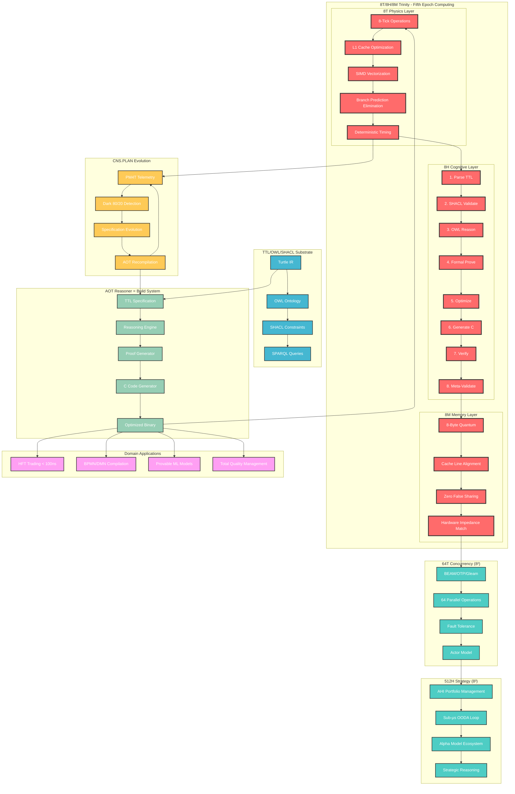
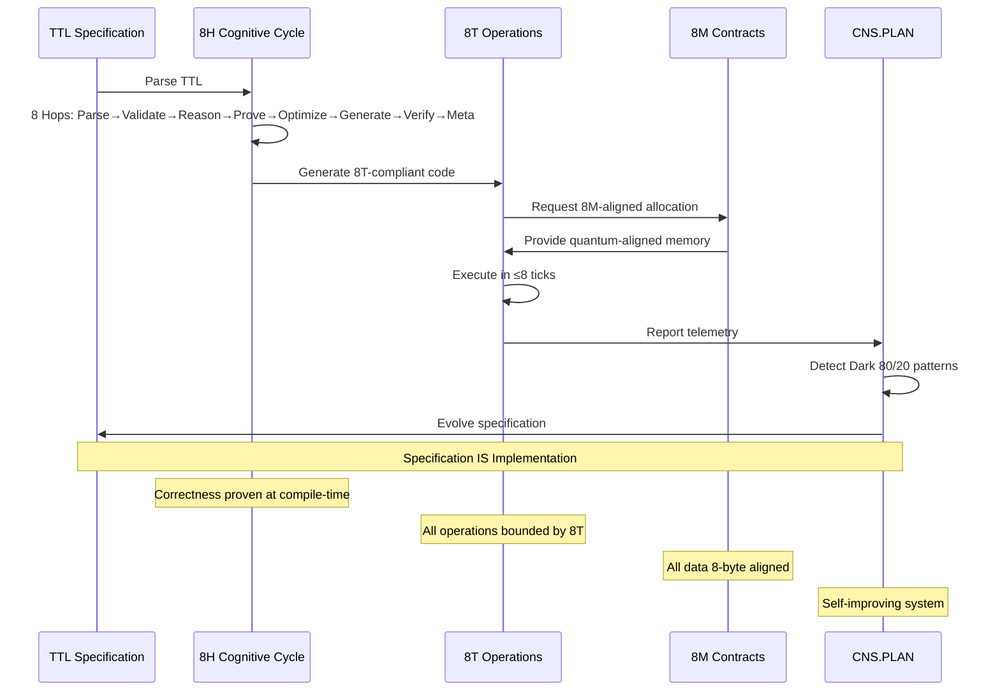
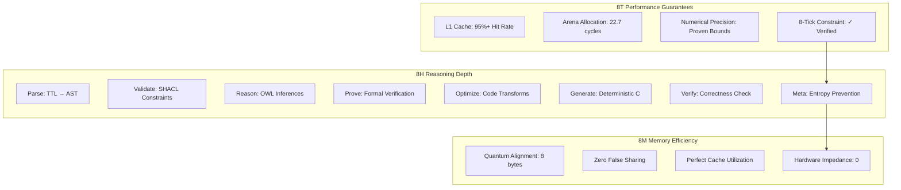
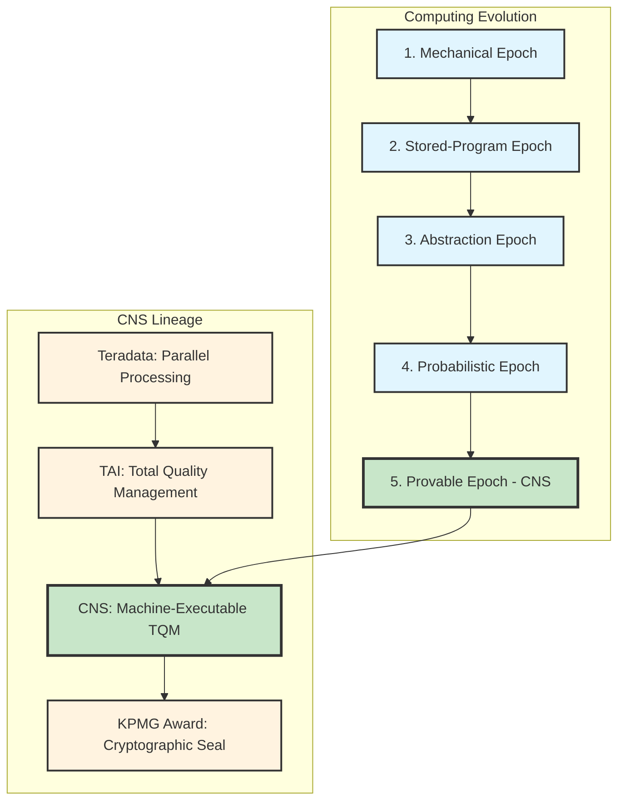

# CNS 8T/8H/8M Trinity Architecture Diagram

## The Fifth Epoch Computing Architecture

## Trinity Component Integration

## Fifth Epoch Paradigm Shifts

```mermaid
graph LR
    subgraph "Traditional Computing"
        T1[Specification] --> T2[Implementation]
        T2 --> T3[Testing]
        T3 --> T4[Debugging]
        T4 --> T5[Runtime Errors]
    end
    
    subgraph "Fifth Epoch Computing"
        F1[Specification = Implementation] --> F2[Compile-Time Proof]
        F2 --> F3[8T/8H/8M Execution]
        F3 --> F4[Proven Correctness]
        F4 --> F5[Self-Evolution]
    end
    
    T5 -.->|"Paradigm Shift"| F1
    
    classDef traditional fill:#ffcccb,stroke:#333,stroke-width:2px
    classDef fifth fill:#90ee90,stroke:#333,stroke-width:2px
    
    class T1,T2,T3,T4,T5 traditional
    class F1,F2,F3,F4,F5 fifth
```

## Performance Characteristics

## Legacy and Lineage

