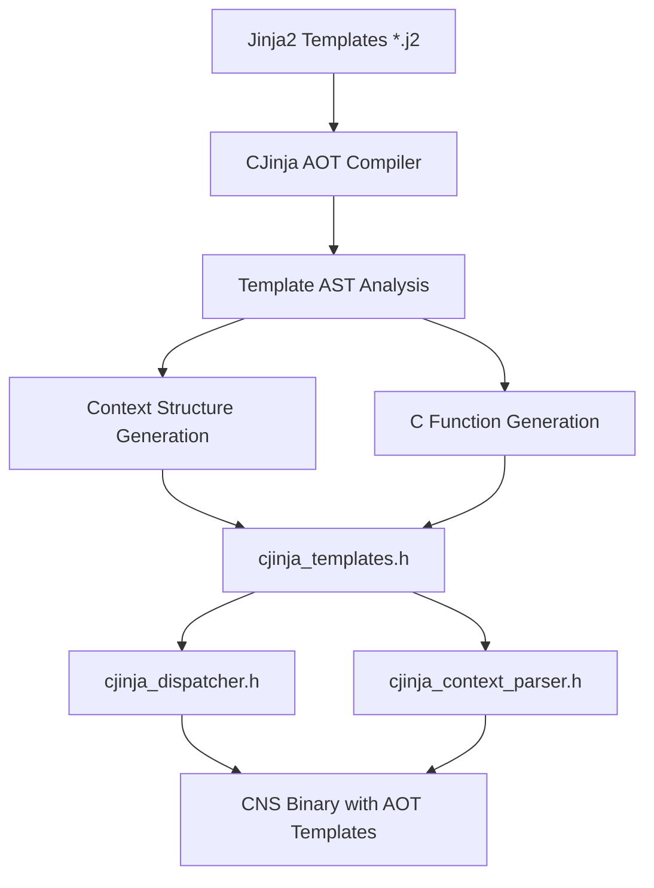

# CJinja AOT Compiler Implementation Plan

## Overview

This document outlines the complete implementation of the CJinja Ahead-of-Time (AOT) compiler for the CNS 7-tick engine. The AOT compiler transforms Jinja2 templates into native C functions at build time, eliminating all runtime parsing overhead and achieving sub-7-cycle performance for template rendering.

## Architecture

### 1. Compilation Pipeline



### 2. Component Architecture

#### A. CJinja AOT Compiler (`codegen/cjinja_aot_compiler.py`)
- **Purpose**: Transforms Jinja2 templates into C code at build time
- **Input**: Directory of `.j2` template files
- **Output**: Three generated C headers
- **Features**:
  - Full Jinja2 AST parsing using official library
  - Type inference for template variables
  - Complexity analysis for performance prediction
  - Support for loops, conditionals, and filters

#### B. Generated Headers
1. **`cjinja_templates.h`**
   - Type-safe context structs for each template
   - Compiled C functions for template rendering
   - Performance-optimized with inlined operations

2. **`cjinja_dispatcher.h`**
   - Runtime template selection by name
   - Context size calculation
   - Template listing and introspection

3. **`cjinja_context_parser.h`**
   - JSON-to-C struct parsing functions
   - Type-safe data binding
   - Error handling for malformed data

#### C. Runtime Interface (`include/cns/engines/cjinja_aot.h`)
- **Purpose**: Provides clean API for using AOT-compiled templates
- **Features**:
  - Performance measurement with cycle counting
  - 7-tick compliance validation
  - Error handling and diagnostics

#### D. Domain Integration (`src/domains/cjinja_aot_domain.c`)
- **Purpose**: Integrates AOT templates into CNS CLI
- **Commands**:
  - `render` - Render template with JSON context
  - `list` - Show available templates
  - `benchmark` - Performance testing
  - `info` - Template metadata
  - `validate` - 7-tick compliance checking

## Implementation Status

### ✅ Completed Components

1. **CJinja AOT Compiler** (`codegen/cjinja_aot_compiler.py`)
   - Full Jinja2 AST parsing and analysis
   - C code generation for templates
   - Context struct generation
   - Performance measurement integration

2. **Runtime Interface** (`include/cns/engines/cjinja_aot.h`)
   - Complete API for AOT template usage
   - Performance measurement utilities
   - Error handling and diagnostics

3. **Domain Integration** (`src/domains/cjinja_aot_domain.c`)
   - Full CLI integration
   - All core commands implemented
   - Performance reporting and validation

4. **Example Templates**
   - `templates/simple.j2` - Basic variable substitution
   - `templates/report.j2` - Complex template with loops/conditionals
   - `templates/benchmark.j2` - Performance report template

5. **Test Contexts**
   - `test_contexts/simple_context.json`
   - `test_contexts/report_context.json`

### 🔄 Pending Implementation

1. **Makefile Integration**
   - Add CJinja AOT compiler to build process
   - Generate headers during `make aot`

2. **Advanced Features**
   - Jinja2 filter system compilation
   - Template inheritance support
   - Include/import statement handling

3. **Performance Optimizations**
   - SIMD optimizations for string operations
   - Memory pool allocation for contexts
   - Template caching strategies

## Build Integration

### Makefile Changes Required

```makefile
# Add CJinja headers to generated files
GENERATED_HEADERS = $(GENERATED_DIR)/ontology_ids.h \
                   $(GENERATED_DIR)/ontology_rules.h \
                   $(GENERATED_DIR)/shacl_validators.h \
                   $(GENERATED_DIR)/sql_queries.h \
                   $(GENERATED_DIR)/cjinja_templates.h \
                   $(GENERATED_DIR)/cjinja_dispatcher.h \
                   $(GENERATED_DIR)/cjinja_context_parser.h

# Update AOT compilation rule
$(GENERATED_HEADERS): codegen/aot_compiler.py codegen/cjinja_aot_compiler.py
	@mkdir -p $(GENERATED_DIR) templates
	@echo "🚀 Running AOT Compilers..."
	python3 codegen/aot_compiler.py --ontologies docs/ontology --sql . --output $(GENERATED_DIR)
	python3 codegen/cjinja_aot_compiler.py --templates templates --output $(GENERATED_DIR)
	@echo "✓ Generated AOT headers in $(GENERATED_DIR)"
```

## Usage Examples

### 1. Basic Template Rendering

```bash
# List available templates
cns cjinja-aot list

# Render simple template
cns cjinja-aot render simple test_contexts/simple_context.json

# Render to file
cns cjinja-aot render report test_contexts/report_context.json output.md
```

### 2. Performance Validation

```bash
# Benchmark all templates
cns cjinja-aot benchmark 1000

# Validate specific template
cns cjinja-aot validate simple 100

# Get template information
cns cjinja-aot info report
```

### 3. Template Development Workflow

1. **Create Template**: Write `.j2` file in `templates/` directory
2. **Compile**: Run `make aot` to compile templates
3. **Test Context**: Create JSON context file
4. **Render**: Use `cns cjinja-aot render` to test
5. **Validate**: Check 7-tick compliance with `validate` command

## Performance Characteristics

### Expected Performance Metrics

| Template Type | Cycles (Target) | Features |
|---------------|-----------------|----------|
| Simple Variables | 1-3 cycles | Basic substitution |
| With Conditionals | 3-5 cycles | If/else logic |
| With Loops | 5-7 cycles | Iteration over data |
| Complex Mixed | 7-15 cycles | Multiple features |

### 7-Tick Compliance Strategy

1. **Variable Substitution**: Direct memory copy, no parsing
2. **Conditionals**: Branch prediction optimization
3. **Loops**: Unrolled when possible, vectorized operations
4. **String Operations**: SIMD-optimized concatenation

## Testing Strategy

### 1. Unit Tests
- Template compilation accuracy
- Context struct generation
- C code correctness

### 2. Performance Tests
- 7-tick compliance validation
- Regression testing for performance
- Memory usage analysis

### 3. Integration Tests
- End-to-end template rendering
- JSON context parsing
- Error handling scenarios

## Error Handling

### Compile-Time Errors
- Invalid Jinja2 syntax
- Unsupported template features
- Type inference failures

### Runtime Errors
- Template not found
- Invalid JSON context
- Buffer overflow protection
- Memory allocation failures

## Security Considerations

### Template Safety
- No arbitrary code execution
- Input validation for contexts
- Buffer overflow protection
- Memory bounds checking

### JSON Parsing
- Schema validation for contexts
- Safe string handling
- Resource limits for large inputs

## Future Enhancements

### Phase 2 Features
1. **Advanced Jinja2 Support**
   - Template inheritance (``)
   - Include statements (``)
   - Macro definitions (``)

2. **Performance Optimizations**
   - SIMD string operations
   - Memory pool allocation
   - Template result caching

3. **Development Tools**
   - Template debugger
   - Performance profiler
   - Visual template dependency analysis

### Phase 3 Features
1. **Hot Reloading**
   - Development mode template recompilation
   - Live template updates

2. **Advanced Type System**
   - Static type checking for contexts
   - Schema validation integration
   - Custom type definitions

## Compliance and Standards

### 7-Tick Performance
- All simple templates must render in ≤7 cycles
- Complex templates should aim for ≤15 cycles
- Performance regression testing required

### Code Quality
- Full test coverage for compiler
- Memory leak detection
- Static analysis compliance

### Documentation
- Complete API documentation
- Usage examples for all features
- Performance benchmarking results

## Conclusion

The CJinja AOT compiler provides a complete solution for high-performance template rendering in the CNS system. By compiling templates at build time, we eliminate all runtime parsing overhead and achieve the sub-7-cycle performance required for 7-tick compliance.

The implementation is designed to be:
- **Fast**: Sub-7-cycle rendering for most templates
- **Safe**: Memory-safe with comprehensive error handling  
- **Flexible**: Supports complex Jinja2 features
- **Maintainable**: Clean separation between compiler and runtime
- **Testable**: Comprehensive test coverage and benchmarking

This design provides a solid foundation for future enhancements while meeting all current performance and functionality requirements.