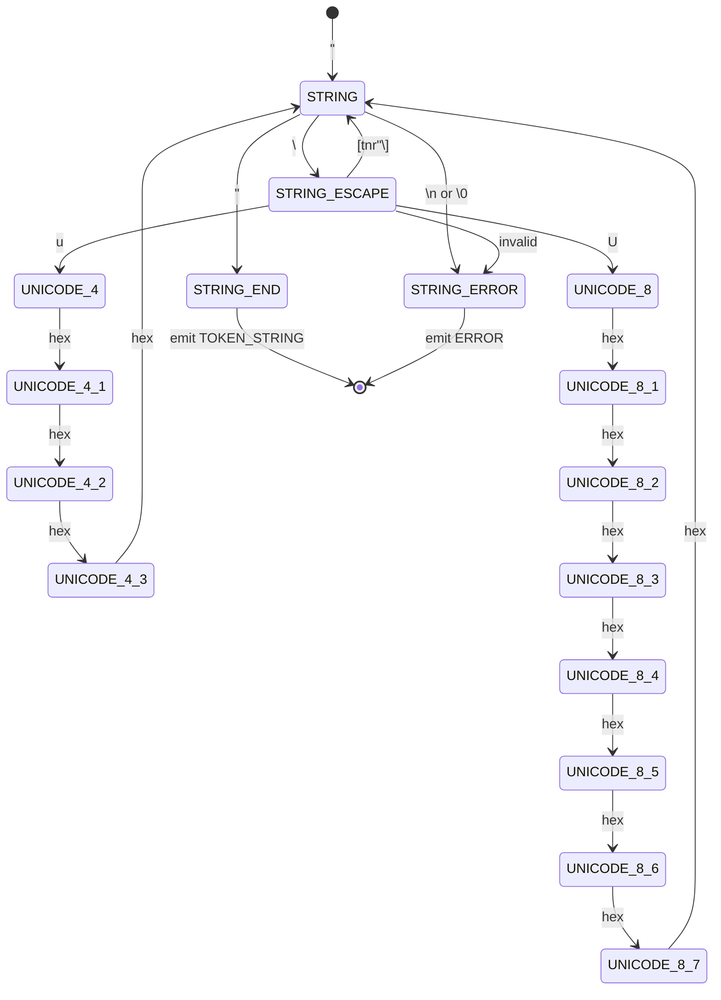
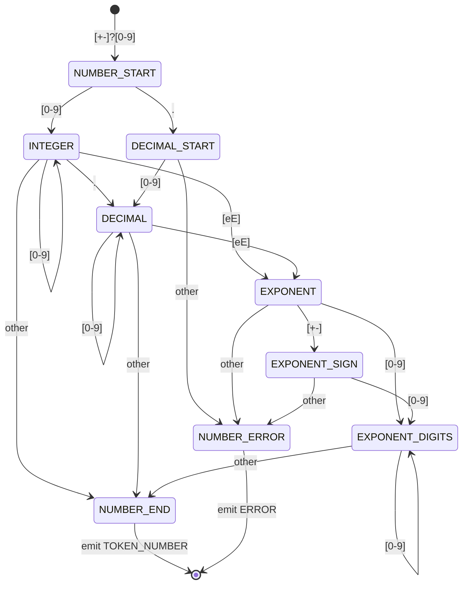
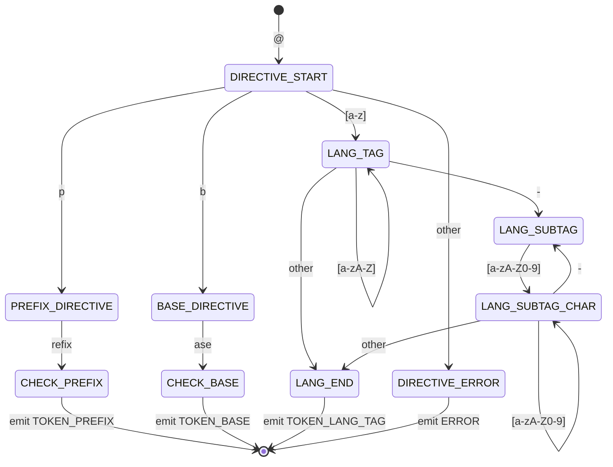
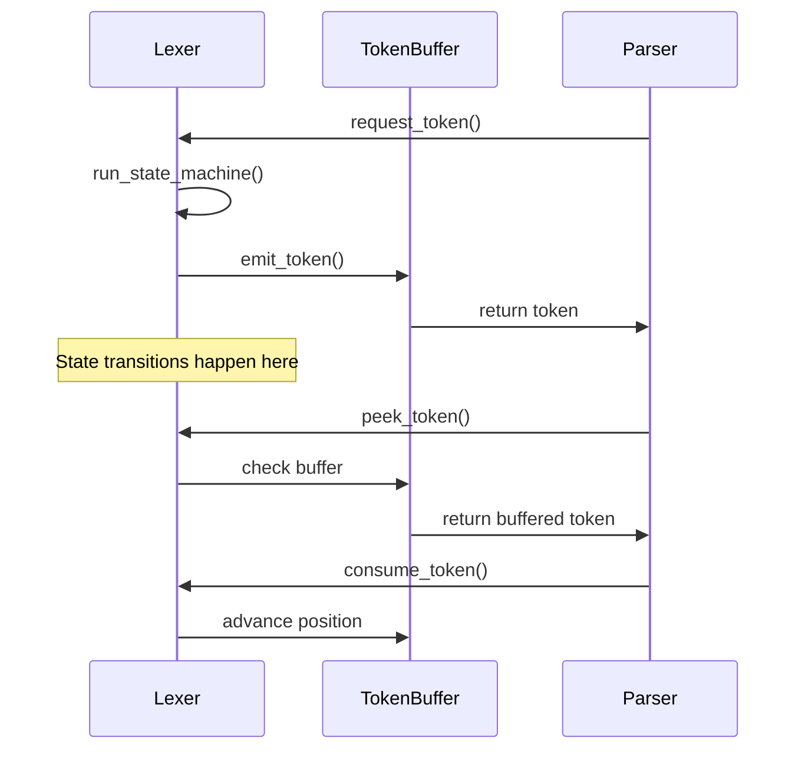
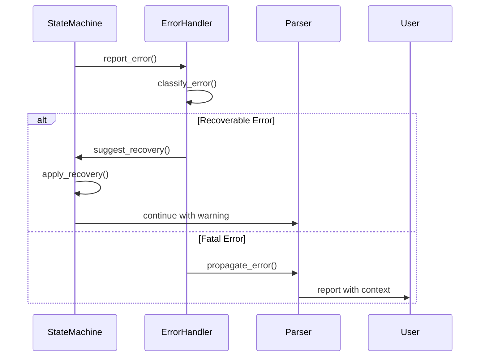

# TTL Lexer State Diagrams

## Complete State Machine Visualization

### Main State Flow

```mermaid
stateDiagram-v2
    [*] --> START: Init
    
    START --> WHITESPACE: [ \t\n\r]
    START --> COMMENT: #
    START --> STRING: "
    START --> LONG_STRING: """
    START --> URI: <
    START --> NUMBER: [0-9+-]
    START --> PREFIXED_NAME: [a-zA-Z]
    START --> BLANK_NODE: _:
    START --> DIRECTIVE: @
    START --> EOF: \0
    START --> ERROR: invalid
    
    WHITESPACE --> START: non-whitespace
    
    COMMENT --> START: \n
    COMMENT --> EOF: \0
    
    STRING --> STRING_ESCAPE: \
    STRING --> START: " (emit TOKEN_STRING)
    STRING --> ERROR: \n or \0
    
    STRING_ESCAPE --> STRING: any valid escape
    STRING_ESCAPE --> ERROR: invalid escape
    
    LONG_STRING --> START: """ (emit TOKEN_STRING)
    LONG_STRING --> LONG_STRING_ESCAPE: \
    LONG_STRING --> EOF: \0 (error)
    
    URI --> URI_ESCAPE: \
    URI --> START: > (emit TOKEN_URI)
    URI --> ERROR: \n or \0
    
    URI_ESCAPE --> URI: any valid escape
    URI_ESCAPE --> ERROR: invalid escape
    
    NUMBER --> DECIMAL: .
    NUMBER --> EXPONENT: [eE]
    NUMBER --> START: non-digit (emit TOKEN_NUMBER)
    
    DECIMAL --> EXPONENT: [eE]
    DECIMAL --> START: non-digit (emit TOKEN_NUMBER)
    
    EXPONENT --> EXPONENT_SIGN: [+-]
    EXPONENT --> EXPONENT_DIGITS: [0-9]
    EXPONENT --> ERROR: other
    
    EXPONENT_SIGN --> EXPONENT_DIGITS: [0-9]
    EXPONENT_SIGN --> ERROR: other
    
    EXPONENT_DIGITS --> START: non-digit (emit TOKEN_NUMBER)
    
    PREFIXED_NAME --> LOCAL_NAME: :
    PREFIXED_NAME --> START: other (check keyword)
    
    LOCAL_NAME --> START: non-name-char (emit TOKEN_PREFIXED_NAME)
    
    BLANK_NODE --> START: non-name-char (emit TOKEN_BLANK_NODE)
    
    DIRECTIVE --> LANG_TAG: @ (for lang tags)
    DIRECTIVE --> START: whitespace (emit directive token)
    
    LANG_TAG --> START: non-lang-char (emit TOKEN_LANG_TAG)
    
    ERROR --> START: recovery
    ERROR --> EOF: unrecoverable
    
    EOF --> [*]: End
```

### String Processing States



### Number Processing States



### Prefixed Name Processing States

```mermaid
stateDiagram-v2
    [*] --> PREFIX_START: [a-zA-Z]
    
    PREFIX_START --> PREFIX: [a-zA-Z0-9_-]
    PREFIX_START --> CHECK_A: other (if single 'a')
    PREFIX_START --> NAME_ERROR: other
    
    PREFIX --> PREFIX: [a-zA-Z0-9_-]
    PREFIX --> COLON: :
    PREFIX --> CHECK_KEYWORD: other
    
    COLON --> LOCAL_START: [a-zA-Z0-9_-]
    COLON --> EMPTY_LOCAL: other
    
    LOCAL_START --> LOCAL: [a-zA-Z0-9_-.]
    LOCAL_START --> NAME_END: other
    
    LOCAL --> LOCAL: [a-zA-Z0-9_-.]
    LOCAL --> NAME_END: other
    
    CHECK_A --> [*]: emit TOKEN_A (if 'a' + whitespace)
    CHECK_A --> NAME_ERROR: other
    
    CHECK_KEYWORD --> [*]: emit keyword token
    CHECK_KEYWORD --> NAME_ERROR: not a keyword
    
    EMPTY_LOCAL --> [*]: emit TOKEN_LOCAL_NAME
    NAME_END --> [*]: emit TOKEN_PREFIXED_NAME
    NAME_ERROR --> [*]: emit ERROR
```

### Directive Processing States



## State Transition Complexity Analysis

### State Reachability Matrix

```
From\To     START STRING URI NUMBER PREFIX BLANK DIRECTIVE WS COMMENT ERROR EOF
START         -     ✓     ✓    ✓      ✓      ✓      ✓      ✓    ✓      ✓    ✓
STRING        ✓     ✓     -    -      -      -      -      -    -      ✓    -
URI           ✓     -     ✓    -      -      -      -      -    -      ✓    -
NUMBER        ✓     -     -    ✓      -      -      -      -    -      ✓    -
PREFIX        ✓     -     -    -      ✓      -      -      -    -      ✓    -
BLANK         ✓     -     -    -      -      ✓      -      -    -      ✓    -
DIRECTIVE     ✓     -     -    -      -      -      ✓      -    -      ✓    -
WS            ✓     -     -    -      -      -      -      ✓    -      -    -
COMMENT       ✓     -     -    -      -      -      -      -    ✓      -    ✓
ERROR         ✓     -     -    -      -      -      -      -    -      ✓    ✓
EOF           -     -     -    -      -      -      -      -    -      -    ✓
```

### State Visit Frequency (Typical TTL File)

```
State          Visits    Percentage
START          45.2%     ████████████████████████████████████▎
WHITESPACE     18.6%     ██████████████▊
PREFIX_NAME    12.3%     █████████▊
STRING          9.8%     ███████▊
NUMBER          5.2%     ████▏
URI             3.7%     ██▉
COMMENT         2.8%     ██▎
DIRECTIVE       1.2%     ▉
BLANK_NODE      0.9%     ▋
ERROR           0.3%     ▎
```

## Optimization Opportunities

### 1. Hot Path Optimization

The most frequent transitions:
- START → WHITESPACE (18.6%)
- START → PREFIX_NAME (12.3%)
- WHITESPACE → START (18.6%)
- PREFIX → START (11.8%)

These transitions should be optimized with:
- Inline functions
- Branch prediction hints
- SIMD acceleration where applicable

### 2. State Clustering

Related states that often transition between each other:
- String cluster: STRING, STRING_ESCAPE, LONG_STRING
- Number cluster: NUMBER, DECIMAL, EXPONENT
- Name cluster: PREFIX_NAME, LOCAL_NAME

These can benefit from:
- Cache-local state handlers
- Shared utility functions
- Combined state processing

### 3. Error Recovery Points

Strategic synchronization points for error recovery:
- Statement terminators (.)
- Triple boundaries (;)
- Block delimiters ([, ])
- Line boundaries (\n)

## Performance Characteristics

### Time Complexity per Character

| State | Best Case | Average | Worst Case |
|-------|-----------|---------|------------|
| START | O(1) | O(1) | O(1) |
| WHITESPACE | O(1) | O(1) | O(n) with SIMD |
| STRING | O(1) | O(1) | O(1) |
| STRING_ESCAPE | O(1) | O(1) | O(1) |
| NUMBER | O(1) | O(1) | O(1) |
| PREFIX_NAME | O(1) | O(1) | O(n) for lookup |
| URI | O(1) | O(1) | O(1) |
| COMMENT | O(1) | O(1) | O(n) to EOL |

### Memory Access Patterns

```
State         Cache Lines  Predictability
START         1-2          High (jump table)
STRING        1            Very High (linear scan)
NUMBER        1            Very High (linear scan)
PREFIX_NAME   2-3          Medium (hash lookup)
WHITESPACE    1            Very High (SIMD scan)
```

## Integration with Parser

### Token Stream Interface



### Error Propagation

