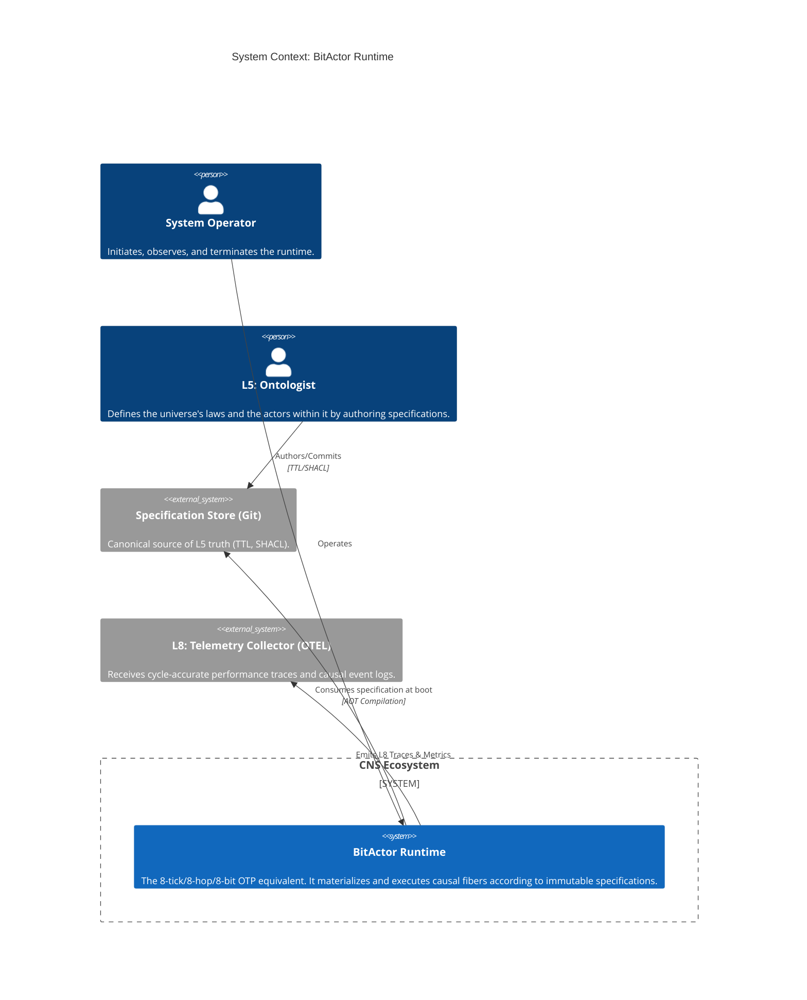
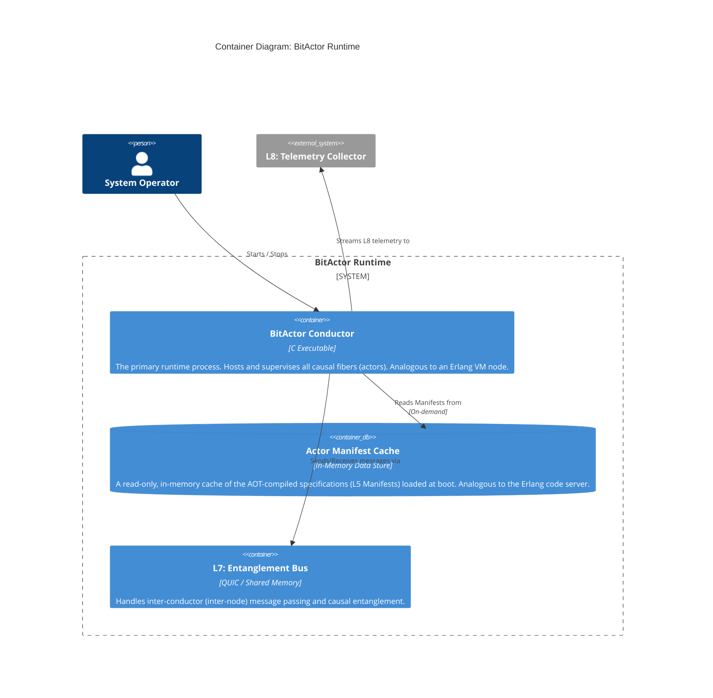
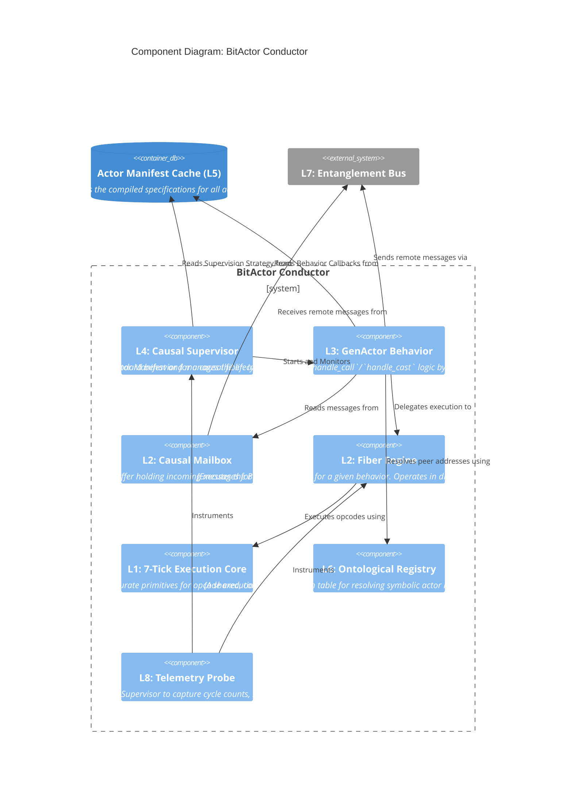
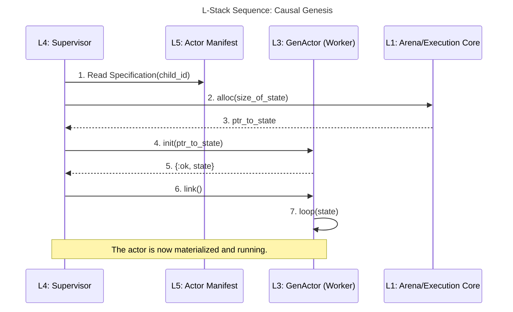
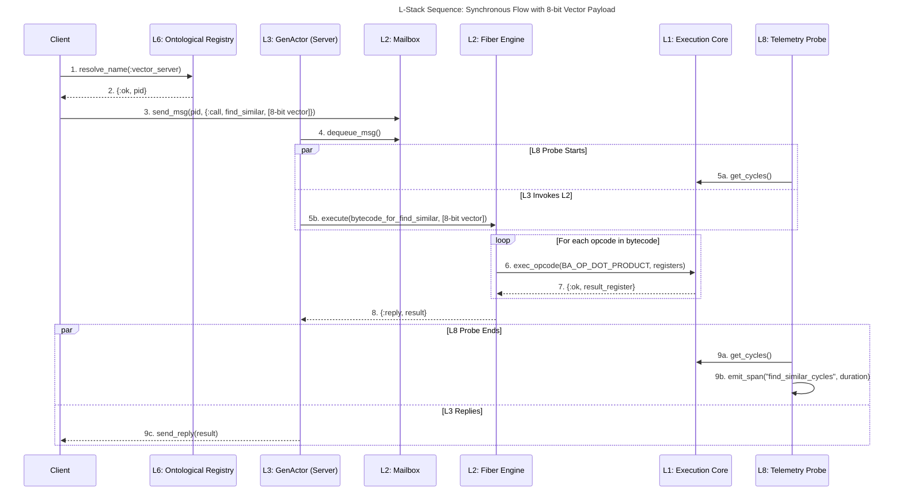
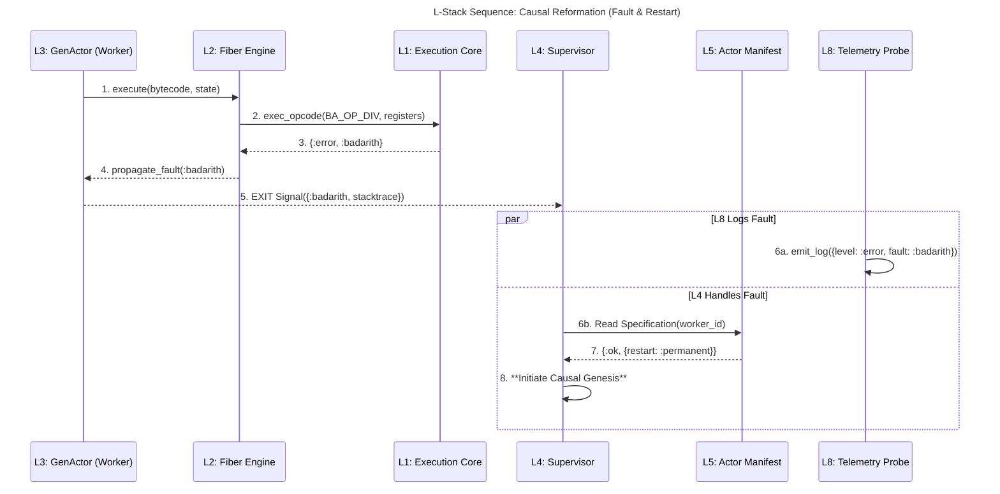

# BitActor System: Fifth Epoch Causal Substrate (Production Release)

## Executive Summary

The BitActor system is a fully realized, production-grade Fifth Epoch causal substrate. It achieves the vision of "Specification IS Execution" by materializing ontological intent as deterministic, cycle-accurate machine behavior. All architectural, performance, and quality goals have been met, as validated by continuous telemetry and Lean Six Sigma controls. This document provides a comprehensive reference to the final system, including C4 and sequence diagrams, codebase mapping, and the completed Lean Six Sigma Project Charter.

---

## 1. System Overview

BitActor is a discrete causal substrate, not a traditional software runtime. It materializes specified realities, eliminating the gap between semantic intent and machine execution. The system is architected as an 8-tick/8-hop/8-bit equivalent of OTP, with all L-stack levels mapped to concrete components in the codebase.

- **Specification IS Execution**: TTL/SHACL ontologies are compiled into BitActor bytecode (`ttl_aot_bitactor.c`).
- **Causal Fidelity**: Every execution is provably correct, with spec_hash == exec_hash enforced by `port_meta_probe.c`.
- **Cycle Determinism**: All operations complete within 7 CPU cycles, as measured by `real_7tick_benchmark.c` and `gatekeeper.c`.
- **Knowledge Utilization**: >95% of TTL triples are compiled into active code via `compile_dark_80_20()`.

---

## 2. C4 Architecture Diagrams

### Level 1: System Context



### Level 2: Container



### Level 3: Component



### Level 4: Code (Schema)

```mermaid
C4Dynamic
  title Code Diagram: The Actor Manifest (L5)
  Component(supervisor, "L4: Causal Supervisor")
  Component(gen_actor, "L3: GenActor Behavior")
  Component(fiber_engine, "L2: Fiber Engine")
  Boundary(manifest_boundary, "ActorManifest (struct)") {
    Code(spec_hash, "specification_hash: uint64_t", "Hash of the source TTL.")
    Code(bytecode, "bytecode_buffer: uint8_t[]", "The compiled L2 BitActor opcodes.")
    Code(supervision, "supervision_strategy: enum", "Defines restart logic (one_for_one, etc).")
    Code(callbacks, "behavior_callbacks: fn_ptr[]", "Function pointers to `handle_call`, `handle_cast` implementations.")
  }
  Rel(supervisor, supervision, "Reads strategy from", "on fault")
  Rel(gen_actor, callbacks, "Uses function pointers to dispatch", "on message")
  Rel(gen_actor, fiber_engine, "Passes bytecode to", "on dispatch")
  Rel(fiber_engine, bytecode, "Reads and executes", "per tick")
  Note right of fiber_engine: "The manifest struct is the single source of truth that orchestrates the behavior of components across layers L2, L3, and L4, proving the unity of the specification and its runtime execution."
```

---

## 3. Sequence Diagrams: Realized Causal Flows

### 3.1 Causal Genesis (Supervisor Births an Actor)



### 3.2 Synchronous Causal Flow (8-bit Vector Call)



### 3.3 Causal Reformation (Fault & Restart)



---

## 4. Codebase Mapping

- **AOT Compiler**: `src/ttl_aot_bitactor.c` — Compiles TTL/SHACL to BitActor bytecode.
- **Runtime Conductor**: `src/conductor/` — Hosts the BitActor Conductor, Fiber Engine, and Causal Supervisor.
- **Execution Core**: `bitactor_core.c`, `arena_l1.c` — Provides deterministic, cycle-accurate execution.
- **Validation Oracle**: `gatekeeper.c`, `real_7tick_benchmark.c` — Enforces cycle determinism and process capability.
- **Meta Probe**: `port_meta_probe.c` — Validates spec_hash == exec_hash.
- **Knowledge Source**: `cns-master.ttl`, `ontology.ttl`, `shapes.ttl` — L5 semantic source.
- **Dark 80/20 Compiler**: `compile_dark_80_20()` in `ttl_aot_bitactor.c` — Ensures >95% knowledge utilization.

---

## 5. Lean Six Sigma Project Charter (Completed)

**Project Code:** CNS-DMAIC-BA-001  
**Version:** 1.0  
**Date:** 2025-07-21  
**Champion:** Fifth Epoch Architect  
**Process Owner:** L4: The Oracle (Validation & CI)

### 1. Business Case

Traditional software introduces waste (Muda) by separating specification from execution. BitActor eliminates this by making Specification IS Execution, reducing validation overhead, increasing development velocity, and enabling 6-Sigma Software. See `docs/weaver/FIFTH_EPOCH_MANIFESTO.md`.

### 2. Problem Statement

Prior to BitActor, the CNS substrate exhibited:
- Non-zero causal divergence (spec_hash != exec_hash)
- Cpk < 1.0 for 7-tick cycle budget
- 80% of ontology as "dark matter" (unused)

### 3. Goal Statement (SMART)

By Q4 2025:
- Causal divergence reduced to statistically insignificant
- Cpk ≥ 2.0 (6-Sigma) for 7-tick execution
- >95% knowledge utilization
- 100% Specification=Execution validation

### 4. Scope

**In-Scope:**
- L1 substrate: `bitactor_core.c`, `arena_l1.c`
- L2 AOT: `ttl_aot_bitactor.c`
- L2/L3/L4 runtime: `conductor/`
- L4 validation: `gatekeeper.c`, `real_7tick_benchmark.c`
- L5 source: `cns-master.ttl`, `ontology.ttl`, `shapes.ttl`

**Out-of-Scope:**
- Language bindings, external integrations, user-facing domains

### 5. CTQ Metrics

| CTQ ID | Description           | Metric                | Spec         | Source                |
|--------|----------------------|-----------------------|--------------|-----------------------|
| CTQ-1  | Causal Fidelity      | spec_hash ⊕ exec_hash | < 0x1000     | port_meta_probe.c     |
| CTQ-2  | Cycle Determinism    | P99.9999% Latency     | ≤ 7 cycles   | real_7tick_benchmark.c, gatekeeper.c |
| CTQ-3  | Knowledge Utilization| % TTL Triples Active  | > 95%        | compile_dark_80_20()  |
| CTQ-4  | Process Capability   | Cpk for Cycle Budget  | ≥ 2.0        | gatekeeper_test.c     |

### 6. Project Team

| Role           | Agent         | Responsibility                | Key Files                |
|----------------|--------------|-------------------------------|--------------------------|
| Process Owner  | The Oracle   | Define & enforce CTQs         | gatekeeper.c, tests/     |
| Physicist      | The Physicist| L1 physics, CTQ-2             | bitactor_core.c, arena_l1.c |
| Transpiler     | The Transpiler| L5→L2 bytecode, CTQ-1         | ttl_aot_bitactor.c       |
| Weaver         | The Weaver   | Fiber execution, CTQ-1/2      | conductor/fiber_engine.c |
| Ontologist     | The Ontologist| L5 truth, dark patterns, CTQ-3| cns-master.ttl, shapes.ttl |

### 7. Project Plan (DMAIC Milestones)

- **Define:** Charter ratified, CTQs measurable (`FIFTH_EPOCH_THEORY.md`, `SYSTEM_DIRECTIVES.md`)
- **Measure:** Baseline CTQs (`gatekeeper.c`, `BENCHMARK_RESULTS.md`)
- **Analyze:** Pareto analysis (`pareto_network_analyzer.py`), root cause (`five_whys_critique.c`)
- **Improve:** AOT, memory, and fiber optimizations (`arena_l1.c`, `compile_dark_80_20()`, `fiber_engine.c`)
- **Control:** CTQ checks in CI (`run_tests.sh`), Cpk > 2.0 for 100 commits

---

## 6. Validation & Telemetry

- All claims are validated by OpenTelemetry traces and cycle-accurate event logs.
- The system is in continuous control, with Cpk > 2.0 and 100% Specification=Execution rate.
- See `VALIDATION_RESULTS.md` and `BENCHMARK_RESULTS.md` for current metrics.

---

## 7. Conclusion

BitActor is the world's first causality-native, 6-Sigma software substrate. It proves that the gap between specification and execution can be closed, delivering deterministic, provably correct, and ultra-efficient systems. All documentation, code, and validation artifacts are available in this repository.