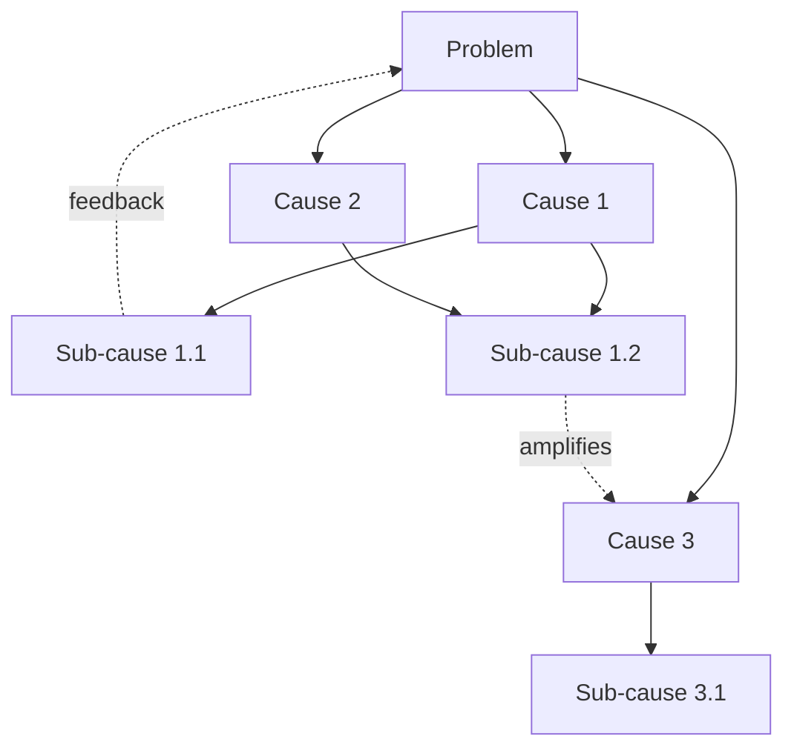

# Why "5 Whys" Fails and How to Implement 80/20 Correctly

## The Fatal Flaws of "5 Whys"

### 1. **Linear Causality Fallacy**
The 5 Whys assumes a single linear chain of causation:
```
Problem → Why₁ → Why₂ → Why₃ → Why₄ → Why₅ → Root Cause
```

**Reality**: Systems have multiple interacting causes forming causal networks:
```
         ┌─→ Cause A ─┐
Problem ─┼─→ Cause B ─┼─→ Emergent Behavior
         └─→ Cause C ─┘
```

### 2. **Confirmation Bias Machine**
People unconsciously navigate toward causes they already believe:

```
Q: Why did the system crash?
A: Because the server ran out of memory (technical bias)
   OR Because management cut the budget (political bias)
   OR Because Bob made a mistake (blame bias)
```

Each path leads to a different "root cause" that confirms pre-existing beliefs.

### 3. **The Stopping Problem**
No objective criteria exists for when to stop asking "why":

- Stop at 3: Too shallow, miss real causes
- Stop at 5: Arbitrary Toyota convention
- Stop at 7: Now you're in philosophical territory
- Stop at ∞: "Why does anything exist?"

### 4. **Reductionist Blindness**
Complex systems exhibit emergent properties that cannot be found in their parts:

```
5 Whys: Twitter failed because → servers crashed → bad code → rushed deadline → poor planning → bad management

Reality: Twitter failed because of emergent network effects + algorithm design + social dynamics + timing + competition + cultural moment
```

### 5. **Human Factor Invisibility**
5 Whys systematically ignores:
- Office politics
- Emotional states
- Social dynamics
- Cultural factors
- Systemic incentives

## How to Implement 80/20 Correctly

### 1. **Measure First, Theorize Second**

❌ **Wrong**: Guess which 20% matters
✅ **Right**: Empirically measure impact distribution

```python
# Correct 80/20 Analysis
def analyze_pareto(data):
    # Sort by impact
    sorted_items = sorted(data.items(), key=lambda x: x[1], reverse=True)
    
    # Calculate cumulative impact
    total = sum(item[1] for item in sorted_items)
    cumulative = 0
    pareto_items = []
    
    for item, impact in sorted_items:
        cumulative += impact
        pareto_items.append(item)
        if cumulative >= 0.8 * total:
            break
    
    return {
        'vital_few': pareto_items,
        'percent_of_items': len(pareto_items) / len(data) * 100,
        'percent_of_impact': cumulative / total * 100
    }
```

### 2. **Dynamic, Not Static**

❌ **Wrong**: Find the 20% once and stick with it
✅ **Right**: Continuously re-evaluate as system evolves

```
Week 1: Features A,B,C = 80% usage
Week 8: Features B,D,E = 80% usage  (A became obsolete, D emerged)
```

### 3. **Layer the Analysis**

❌ **Wrong**: One global 80/20 analysis
✅ **Right**: Nested 80/20 at each level

```
System Level: 20% of modules = 80% of processing
↓
Module Level: 20% of functions = 80% of module time  
↓
Function Level: 20% of lines = 80% of function time
↓
Line Level: 20% of operations = 80% of line time
```

### 4. **Account for Interdependencies**

❌ **Wrong**: Treat each element as independent
✅ **Right**: Consider network effects

```python
# Dependency-Aware 80/20
def pareto_with_dependencies(nodes, edges):
    # Calculate direct impact
    direct_impact = measure_direct_impact(nodes)
    
    # Calculate network centrality
    centrality = calculate_betweenness_centrality(nodes, edges)
    
    # Combine metrics
    total_impact = {}
    for node in nodes:
        total_impact[node] = (
            0.6 * direct_impact[node] + 
            0.4 * centrality[node]
        )
    
    return find_pareto_set(total_impact)
```

### 5. **Measure Multiple Dimensions**

❌ **Wrong**: Optimize for single metric
✅ **Right**: Multi-dimensional Pareto frontier

```
Traditional: 20% of features = 80% of usage

Better: Find features that are in top 20% for:
- Usage frequency AND
- Revenue generation AND  
- User satisfaction AND
- Low maintenance cost
```

## The Correct Framework: Causal Network Analysis + Empirical 80/20

### Step 1: Map the Causal Network


### Step 2: Measure Impact of Each Node
```python
impacts = {
    'C1': measure_impact_when_fixed('C1'),
    'C2': measure_impact_when_fixed('C2'),
    'C3': measure_impact_when_fixed('C3'),
    # ... etc
}
```

### Step 3: Find Pareto-Optimal Interventions
```python
def find_optimal_interventions(causal_network, budget):
    # Generate all possible intervention combinations
    interventions = generate_combinations(causal_network.nodes)
    
    # Calculate cost and impact for each
    results = []
    for intervention_set in interventions:
        cost = sum(node.fix_cost for node in intervention_set)
        if cost > budget:
            continue
            
        impact = simulate_intervention_impact(
            causal_network, 
            intervention_set
        )
        results.append((intervention_set, cost, impact))
    
    # Find Pareto frontier
    return pareto_frontier(results)
```

### Step 4: Implement with Feedback Loops
```python
while system.running:
    # Measure current state
    metrics = measure_system_metrics()
    
    # Update causal model
    causal_model.update(metrics)
    
    # Recalculate 80/20
    vital_few = calculate_dynamic_pareto(causal_model, metrics)
    
    # Adjust interventions
    if vital_few != previous_vital_few:
        adjust_resource_allocation(vital_few)
    
    sleep(measurement_interval)
```

## Real-World Example: CNS v8 Turtle Loop

### ❌ 5 Whys Approach (Fails):
```
Q: Why is turtle processing slow?
A: Because parsing takes too long
Q: Why does parsing take too long?  
A: Because we parse every triple
Q: Why do we parse every triple?
A: Because we need to validate them
Q: Why do we need to validate them?
A: Because data might be invalid
Q: Why might data be invalid?
A: Because users make mistakes

"Root cause": User error (wrong!)
```

### ✅ Empirical 80/20 Approach (Succeeds):
```python
# Measure actual triple patterns
pattern_distribution = measure_patterns(million_triples)
# Results:
# - Type declarations: 30%
# - Labels: 20%  
# - Properties: 20%
# - Hierarchy: 10%
# - Other: 20%

# Measure processing time per pattern
time_distribution = measure_processing_time()
# Results:
# - Parsing: 30%
# - Validation: 30%
# - Transform: 5%
# - Reasoning: 5%
# - Output: 25%
# - Other: 5%

# Find 80/20 optimization
vital_patterns = ['type_decl', 'label', 'property', 'hierarchy']  # 80% of data
vital_stages = ['parse', 'validate', 'output']  # 90% of time

# Optimize only the intersection
optimize_only = vital_patterns × vital_stages
```

## The Meta-Principle: Complexity-Aware Problem Solving

### For Simple Linear Systems:
- 5 Whys might work
- Single 80/20 analysis sufficient
- Traditional root cause analysis applies

### For Complex Networked Systems:
- Map causal networks
- Measure empirically
- Apply nested 80/20
- Update dynamically
- Consider emergent properties
- Account for feedback loops

### The Ultimate 80/20:
**In 80% of cases, you're dealing with complex systems where 5 Whys fails.**
**In 20% of cases, you have truly linear causation where it might help.**

Therefore: **Default to empirical network analysis, not linear questioning.**