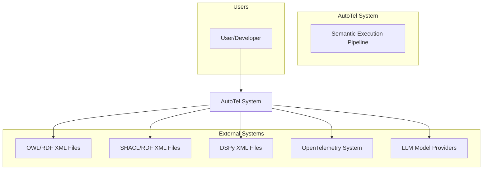
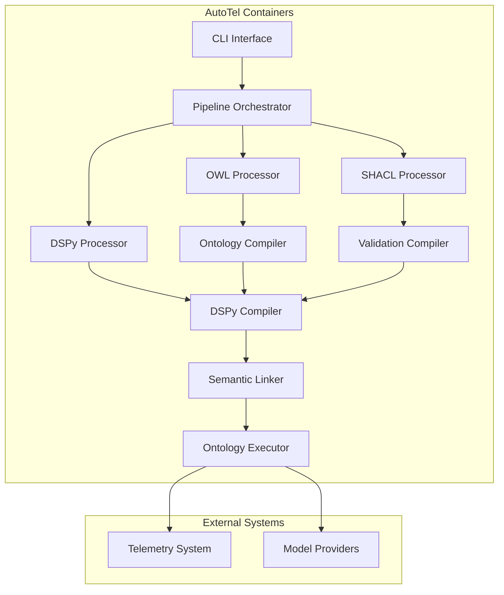
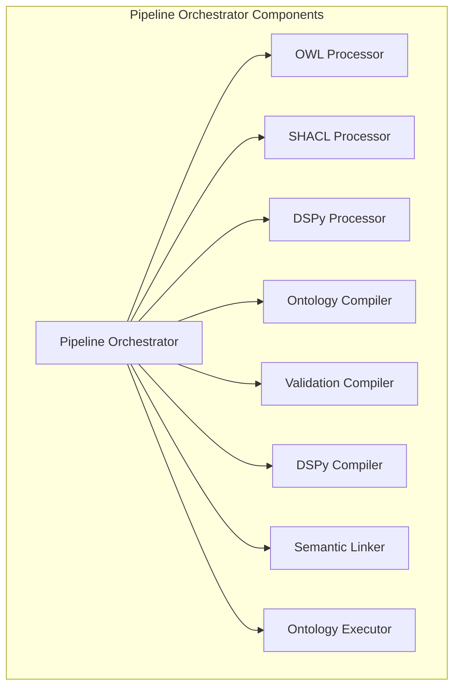
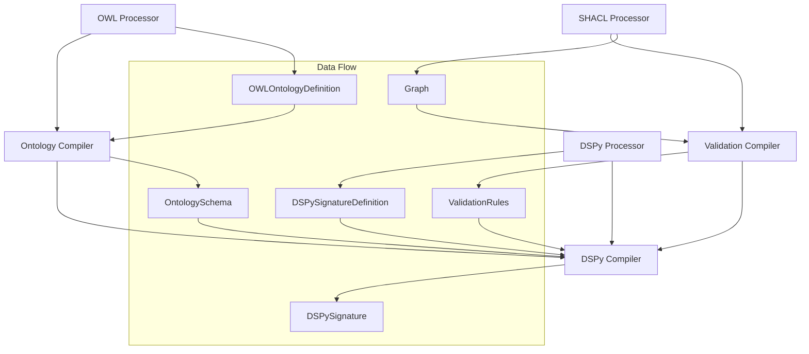
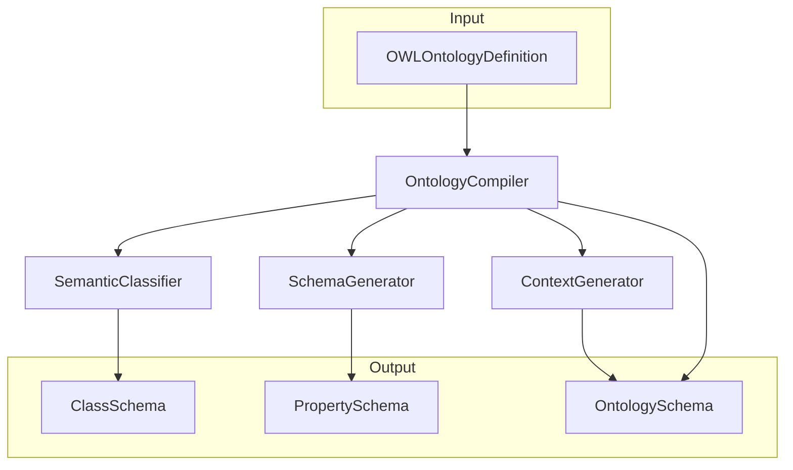
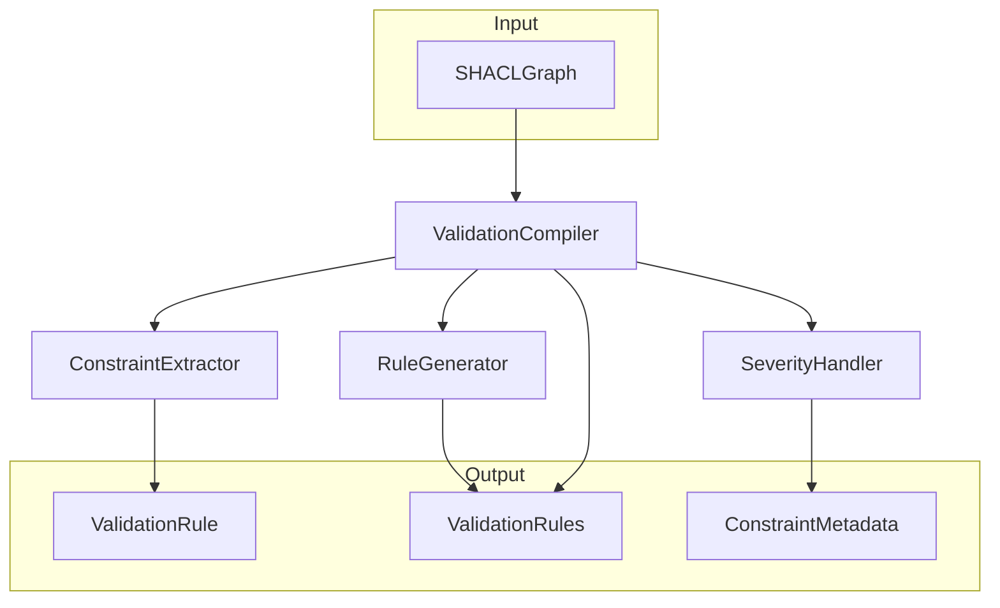
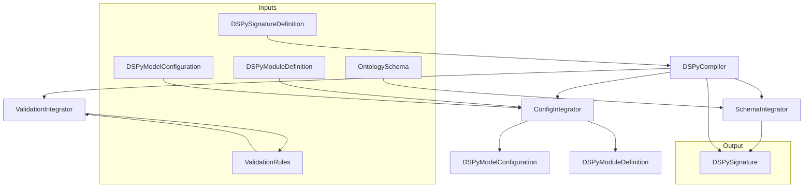
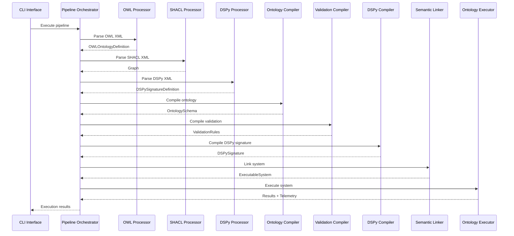

# AutoTel C4 Architecture Diagrams

## Overview
This document contains C4 model diagrams for the AutoTel semantic execution pipeline, focusing on the multi-compiler architecture during the prototype phase.

## C4 Level 1: System Context Diagram



**Description**: The AutoTel system processes ontology and validation XML files to execute DSPy signatures with semantic context and comprehensive telemetry.

## C4 Level 2: Container Diagram



**Description**: The container diagram shows the main architectural components and their relationships in the AutoTel pipeline.

## C4 Level 3: Component Diagram - Pipeline Orchestrator



**Description**: The Pipeline Orchestrator coordinates the execution flow through all pipeline stages.

## C4 Level 3: Component Diagram - Compiler Architecture



**Description**: The compiler architecture shows the data flow between processors and compilers, with the DSPy compiler integrating outputs from all other compilers.

## C4 Level 4: Code Diagram - Ontology Compiler



**Description**: The Ontology Compiler transforms OWL definitions into structured schemas with semantic classifications.

## C4 Level 4: Code Diagram - Validation Compiler



**Description**: The Validation Compiler extracts SHACL constraints and generates structured validation rules.

## C4 Level 4: Code Diagram - DSPy Compiler



**Description**: The DSPy Compiler integrates all inputs to generate execution-ready DSPy signatures.

## Data Flow Sequence Diagram



**Description**: The sequence diagram shows the complete flow through the multi-compiler pipeline.

## Implementation Guidelines

### File Structure
```
autotel/
├── factory/
│   ├── pipeline.py              # Pipeline orchestration
│   ├── ontology_compiler.py     # Ontology compiler
│   ├── validation_compiler.py   # Validation compiler
│   ├── dspy_compiler.py         # DSPy compiler
│   ├── linker.py                # Semantic linker
│   ├── executor.py              # Ontology executor
│   └── processors/
│       ├── owl_processor.py     # OWL processor
│       ├── shacl_processor.py   # SHACL processor
│       └── dspy_processor.py    # DSPy processor
├── schemas/
│   ├── ontology_types.py        # Ontology data structures
│   ├── validation_types.py      # Validation data structures
│   ├── dspy_types.py           # DSPy data structures
│   └── linker_types.py         # Linker data structures
└── core/
    └── telemetry.py            # Telemetry integration
```

### Key Design Principles

1. **Single Responsibility**: Each compiler has one clear purpose
2. **Fail Fast**: No try-catch blocks, let errors crash naturally
3. **Structured Data**: Use dataclasses for all data structures
4. **Clean Dependencies**: Clear separation between components
5. **Telemetry First**: Comprehensive observability throughout

### Integration Points

- **Processors**: Parse XML/RDF into structured data objects
- **Compilers**: Transform data objects into execution-ready objects
- **Linker**: Create executable systems with semantic context
- **Executor**: Run systems with telemetry and validation

This architecture provides a clean, modular design that's easy to implement, test, and maintain while preserving all semantic execution capabilities. 