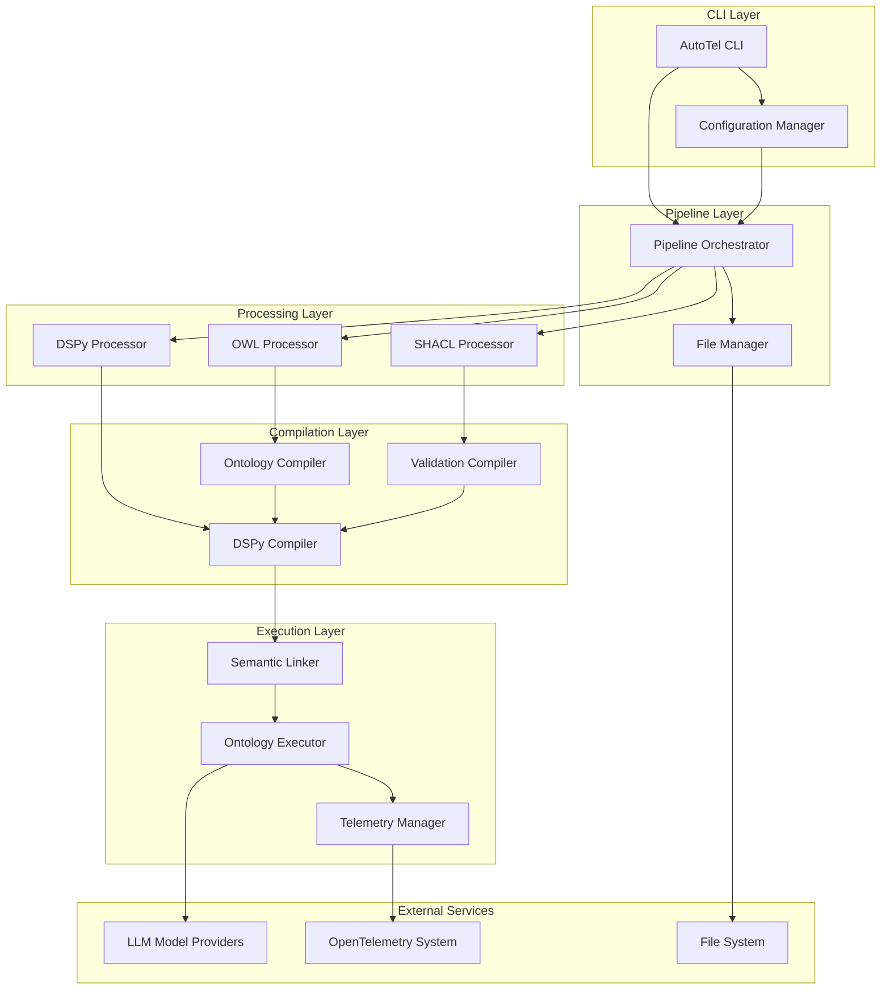
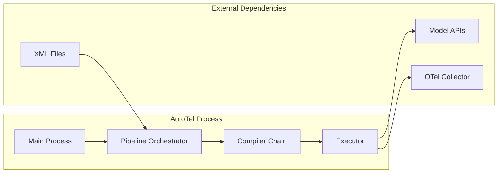
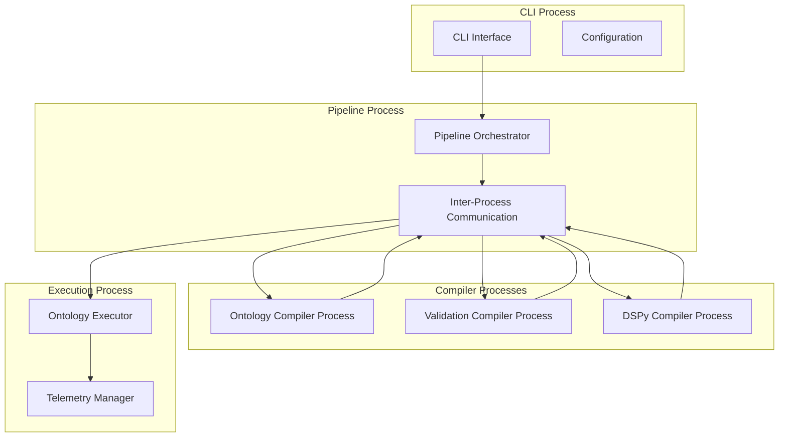
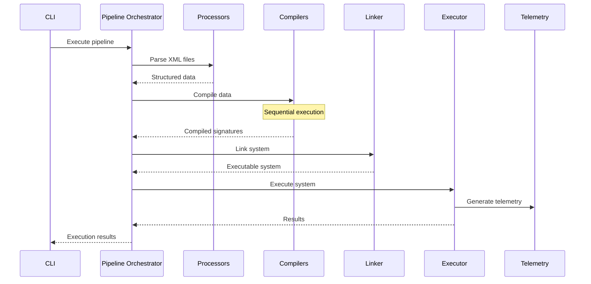
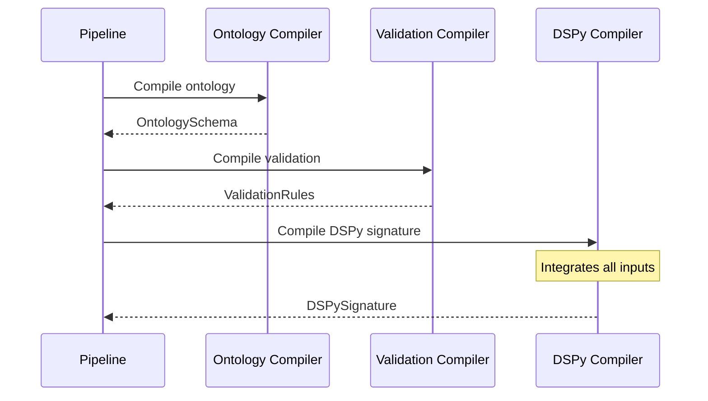
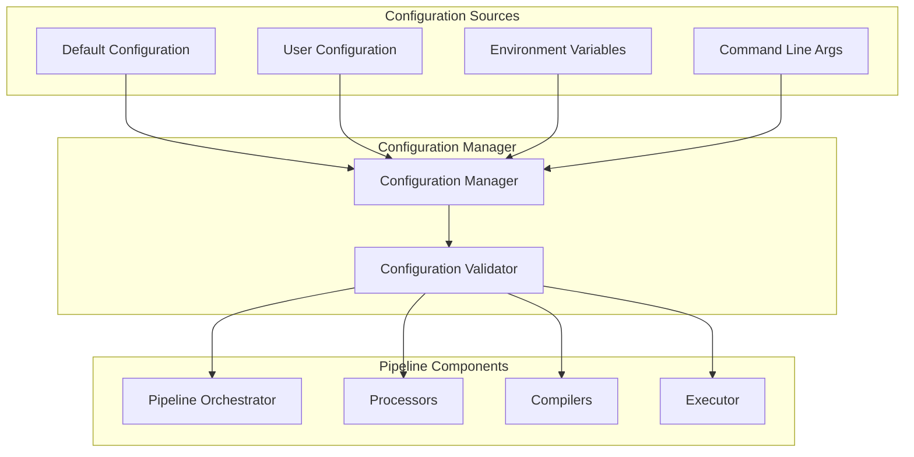
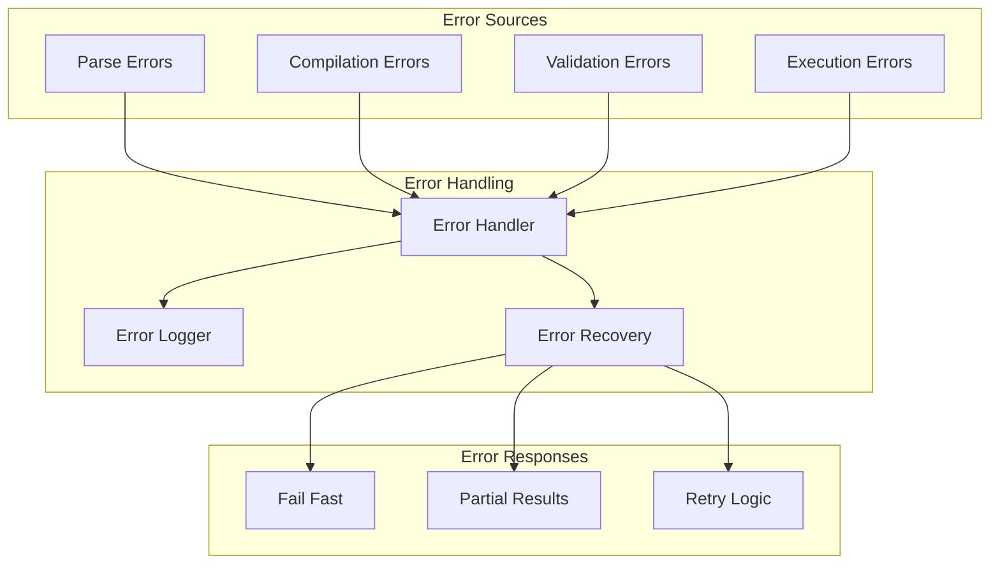
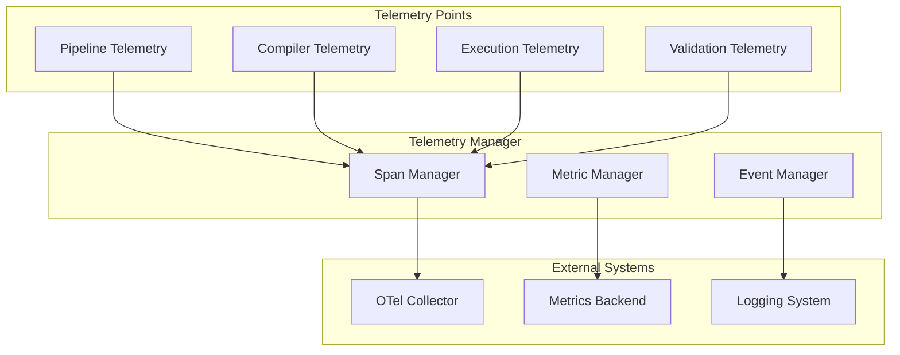

# AutoTel Deployment Architecture

## Runtime Architecture Overview



## Component Deployment Strategy

### Single-Process Architecture (Prototype)


### Multi-Process Architecture (Future)


## Data Flow Architecture

### Pipeline Execution Flow


### Compiler Chain Execution


## Configuration Management

### Configuration Hierarchy


### Configuration Structure
```yaml
# autotel_config.yaml
pipeline:
  processors:
    owl:
      enabled: true
      strict_mode: true
    shacl:
      enabled: true
      validation_level: "strict"
    dspy:
      enabled: true
      xml_validation: true
  
  compilers:
    ontology:
      semantic_classification: true
      cache_results: true
    validation:
      severity_levels: ["Violation", "Warning", "Info"]
      generate_messages: true
    dspy:
      integration_mode: "full"
      preserve_context: true
  
  execution:
    telemetry:
      enabled: true
      sampling_rate: 1.0
      export_interval: 30
    validation:
      runtime_validation: true
      constraint_checking: true
    models:
      default_provider: "openai"
      timeout: 30
      retry_attempts: 3
```

## Error Handling and Recovery

### Error Propagation Strategy


### Error Recovery Strategies
```python
# Error handling strategy for each stage
class PipelineErrorHandler:
    def handle_parse_error(self, error: ParseError) -> None:
        """Handle errors during XML/RDF parsing."""
        # Log error details
        # Fail fast - stop pipeline
        raise PipelineExecutionError(f"Parse error: {error}")
    
    def handle_compile_error(self, error: CompileError) -> None:
        """Handle errors during compilation."""
        # Log error details
        # Fail fast - stop pipeline
        raise PipelineExecutionError(f"Compilation error: {error}")
    
    def handle_execution_error(self, error: ExecutionError) -> None:
        """Handle errors during execution."""
        # Log error details
        # Generate partial results if possible
        # Continue with telemetry
        self.telemetry_manager.record_error(error)
```

## Performance Monitoring

### Telemetry Integration Points


### Performance Metrics
```python
# Key performance indicators
class PerformanceMetrics:
    # Pipeline metrics
    pipeline_execution_time: float
    processor_parse_time: Dict[str, float]
    compiler_execution_time: Dict[str, float]
    
    # Compiler metrics
    ontology_compilation_time: float
    validation_compilation_time: float
    dspy_compilation_time: float
    
    # Execution metrics
    model_inference_time: float
    validation_check_time: float
    telemetry_generation_time: float
    
    # Quality metrics
    parse_success_rate: float
    compilation_success_rate: float
    execution_success_rate: float
```

## Security Considerations

### Input Validation
```python
# Security validation at each stage
class SecurityValidator:
    def validate_xml_input(self, xml_content: str) -> bool:
        """Validate XML input for security threats."""
        # Check for XXE attacks
        # Validate XML structure
        # Check file size limits
        pass
    
    def validate_ontology_definition(self, ontology: OWLOntologyDefinition) -> bool:
        """Validate ontology definition for security."""
        # Check URI validity
        # Validate namespace declarations
        # Check for malicious content
        pass
    
    def validate_execution_context(self, context: Dict[str, Any]) -> bool:
        """Validate execution context for security."""
        # Check model provider credentials
        # Validate telemetry endpoints
        # Check for sensitive data exposure
        pass
```

## Deployment Checklist

### Pre-Deployment
- [ ] All unit tests passing
- [ ] Integration tests passing
- [ ] Performance benchmarks met
- [ ] Security validation completed
- [ ] Configuration validated
- [ ] Documentation updated

### Deployment Steps
1. **Environment Setup**
   - Install dependencies
   - Configure environment variables
   - Set up telemetry endpoints

2. **Configuration Deployment**
   - Deploy configuration files
   - Validate configuration
   - Test configuration loading

3. **Component Deployment**
   - Deploy processors
   - Deploy compilers
   - Deploy linker and executor

4. **Integration Testing**
   - Test end-to-end pipeline
   - Validate telemetry output
   - Test error handling

5. **Monitoring Setup**
   - Configure telemetry collection
   - Set up alerting
   - Monitor performance metrics

### Post-Deployment
- [ ] Monitor system health
- [ ] Track performance metrics
- [ ] Validate telemetry output
- [ ] Test error scenarios
- [ ] Document any issues

This deployment architecture provides a comprehensive guide for implementing and deploying the AutoTel multi-compiler pipeline in production environments. 