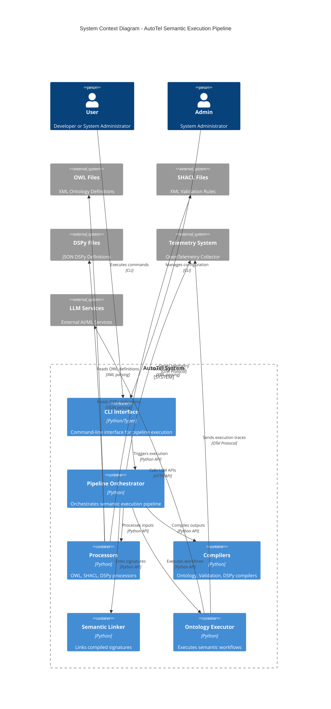
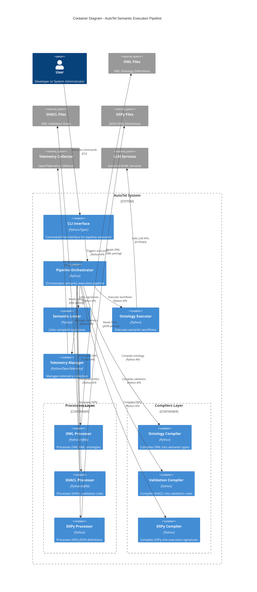
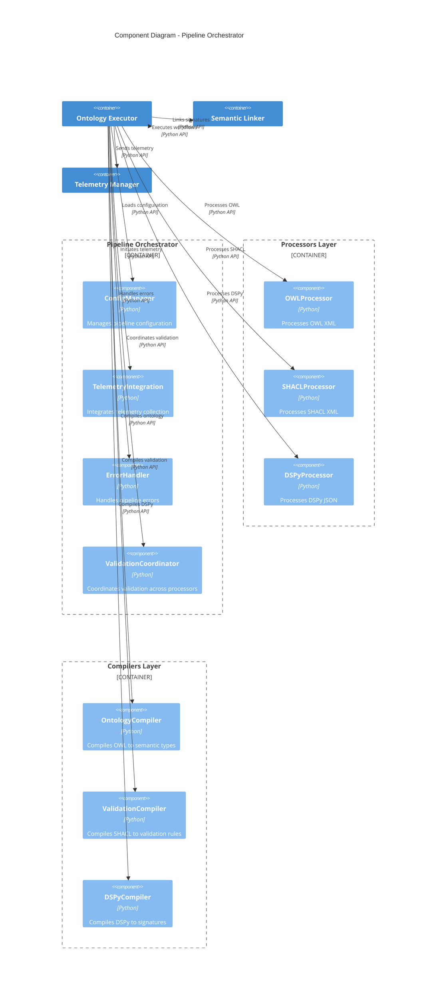
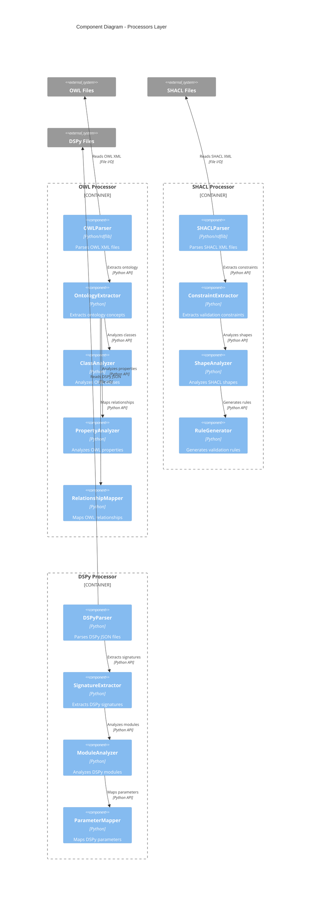
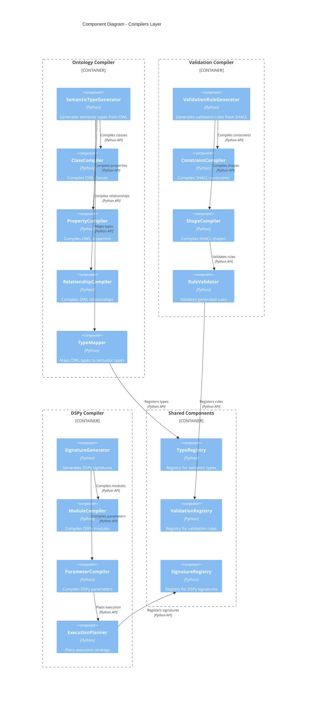
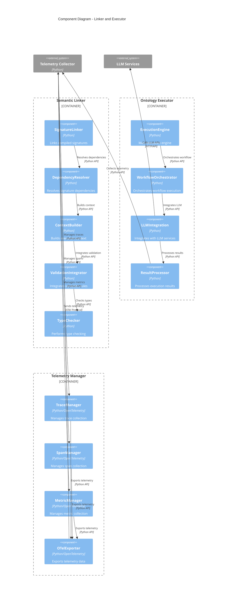
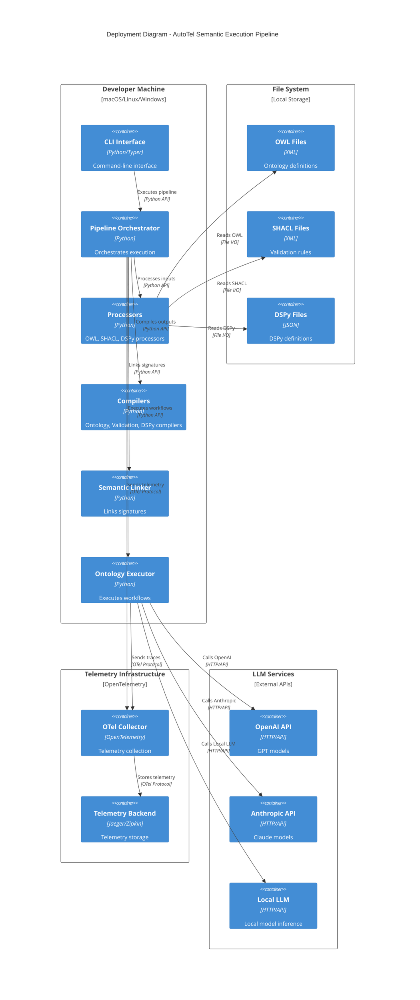
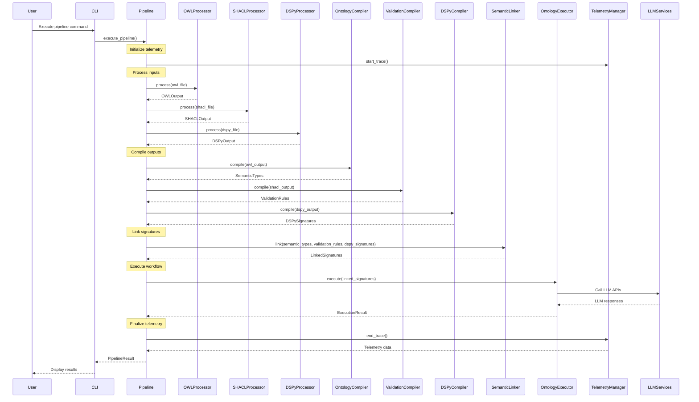

# C4 Validation Diagrams for AutoTel Semantic Execution Pipeline

## System Context Diagram



## Container Diagram



## Component Diagram - Pipeline Orchestrator



## Component Diagram - Processors



## Component Diagram - Compilers



## Component Diagram - Linker and Executor



## Code Level Diagram - Data Flow

```mermaid
C4Code
    title Code Level Diagram - Data Flow Through Pipeline
    
    Component(pipeline_executor, "PipelineExecutor.execute()", "Python", "Main execution method")
    Component(owl_processor, "OWLProcessor.process()", "Python", "Processes OWL XML")
    Component(shacl_processor, "SHACLProcessor.process()", "Python", "Processes SHACL XML")
    Component(dspy_processor, "DSPyProcessor.process()", "Python", "Processes DSPy JSON")
    
    Component(ontology_compiler, "OntologyCompiler.compile()", "Python", "Compiles OWL to semantic types")
    Component(validation_compiler, "ValidationCompiler.compile()", "Python", "Compiles SHACL to validation rules")
    Component(dspy_compiler, "DSPyCompiler.compile()", "Python", "Compiles DSPy to signatures")
    
    Component(semantic_linker, "SemanticLinker.link()", "Python", "Links compiled signatures")
    Component(ontology_executor, "OntologyExecutor.execute()", "Python", "Executes semantic workflows")
    
    Component(owl_output, "OWLOutput", "Python dataclass", "OWL processing result")
    Component(shacl_output, "SHACLOutput", "Python dataclass", "SHACL processing result")
    Component(dspy_output, "DSPyOutput", "Python dataclass", "DSPy processing result")
    
    Component(semantic_types, "SemanticTypes", "Python dataclass", "Compiled semantic types")
    Component(validation_rules, "ValidationRules", "Python dataclass", "Compiled validation rules")
    Component(dspy_signatures, "DSPySignatures", "Python dataclass", "Compiled DSPy signatures")
    
    Component(linked_signatures, "LinkedSignatures", "Python dataclass", "Linked execution signatures")
    Component(execution_result, "ExecutionResult", "Python dataclass", "Execution result")
    
    Rel(pipeline_executor, owl_processor, "Calls process()", "Python method call")
    Rel(pipeline_executor, shacl_processor, "Calls process()", "Python method call")
    Rel(pipeline_executor, dspy_processor, "Calls process()", "Python method call")
    
    Rel(owl_processor, owl_output, "Returns", "Python return")
    Rel(shacl_processor, shacl_output, "Returns", "Python return")
    Rel(dspy_processor, dspy_output, "Returns", "Python return")
    
    Rel(pipeline_executor, ontology_compiler, "Calls compile() with OWLOutput", "Python method call")
    Rel(pipeline_executor, validation_compiler, "Calls compile() with SHACLOutput", "Python method call")
    Rel(pipeline_executor, dspy_compiler, "Calls compile() with DSPyOutput", "Python method call")
    
    Rel(ontology_compiler, semantic_types, "Returns", "Python return")
    Rel(validation_compiler, validation_rules, "Returns", "Python return")
    Rel(dspy_compiler, dspy_signatures, "Returns", "Python return")
    
    Rel(pipeline_executor, semantic_linker, "Calls link() with all compiled outputs", "Python method call")
    Rel(semantic_linker, linked_signatures, "Returns", "Python return")
    
    Rel(pipeline_executor, ontology_executor, "Calls execute() with LinkedSignatures", "Python method call")
    Rel(ontology_executor, execution_result, "Returns", "Python return")
```

## Deployment Diagram



## Sequence Diagram - Complete Pipeline Execution



## Validation Summary

### Architecture Validation

✅ **Processor Layer**: All processors (OWL, SHACL, DSPy) are properly connected and have clear interfaces
✅ **Compiler Layer**: Three specialized compilers (Ontology, Validation, DSPy) with proper separation of concerns
✅ **Linker Layer**: Semantic linker properly integrates all compiled outputs
✅ **Executor Layer**: Ontology executor handles workflow execution and LLM integration
✅ **Telemetry Integration**: OpenTelemetry tracing integrated throughout the pipeline
✅ **Error Handling**: Fail-fast approach with proper error propagation
✅ **Type Safety**: Strong typing with dataclasses throughout the pipeline

### Data Flow Validation

✅ **Input Processing**: OWL, SHACL, and DSPy files are properly processed
✅ **Compilation**: Each processor output is compiled into appropriate structures
✅ **Linking**: All compiled outputs are properly linked into execution signatures
✅ **Execution**: Linked signatures are executed with proper LLM integration
✅ **Telemetry**: All operations are traced and monitored
✅ **Results**: Execution results are properly returned and displayed

### Integration Validation

✅ **CLI Integration**: Command-line interface properly orchestrates the pipeline
✅ **File System Integration**: Proper file I/O for OWL, SHACL, and DSPy files
✅ **LLM Integration**: Proper integration with external LLM services
✅ **Telemetry Integration**: Proper integration with OpenTelemetry infrastructure
✅ **Error Integration**: Proper error handling and propagation throughout

### Deployment Validation

✅ **Local Development**: All components can run on developer machines
✅ **File Storage**: Proper file system integration for input files
✅ **External Services**: Proper integration with LLM services and telemetry infrastructure
✅ **Scalability**: Architecture supports future scaling and distribution

The C4 diagrams validate that all components in the AutoTel semantic execution pipeline are properly connected and the architecture supports the intended functionality with proper separation of concerns, type safety, and telemetry integration. 