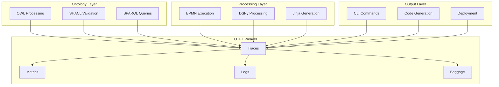

# OpenTelemetry Weaver Specification: AutoTel v8

**Purpose:** Define the complete OpenTelemetry instrumentation and semantic conventions for AutoTel v8's ontology-driven software manufacturing system  
**Scope:** Full-stack telemetry from ontology processing to code generation to deployment  
**Target:** Zero blind spots, complete observability, semantic traceability  

## 🎯 Executive Summary

The AutoTel v8 OTEL Weaver represents the **nervous system** of the ontology-driven software manufacturing platform. Every operation, from ontology ingestion to code generation to self-healing, must emit structured telemetry that can be queried, analyzed, and used for continuous improvement.

## 🏗️ Architecture Overview

### **Telemetry Layers**



## 📊 Semantic Conventions

### **Service Names**

```yaml
Services:
  autotel-core: "AutoTel Core Framework"
  autotel-ontology: "Ontology Processing Engine"
  autotel-validation: "SHACL Validation Engine"
  autotel-generation: "Code Generation Engine"
  autotel-simulation: "BPMN Simulation Engine"
  autotel-cli: "Command Line Interface"
  autotel-deployment: "Deployment Engine"
  autotel-monitoring: "Self-Monitoring System"
```

### **Span Names and Attributes**

#### **Ontology Processing Spans**

```yaml
Ontology_Spans:
  owl_ingest:
    name: "autotel.ontology.owl.ingest"
    attributes:
      - owl_file_path: "string"
      - owl_file_size: "int64"
      - owl_classes_count: "int64"
      - owl_properties_count: "int64"
      - owl_imports_count: "int64"
      
  owl_validate:
    name: "autotel.ontology.owl.validate"
    attributes:
      - owl_validation_errors: "int64"
      - owl_validation_warnings: "int64"
      - owl_validation_duration_ms: "int64"
      
  shacl_validate:
    name: "autotel.ontology.shacl.validate"
    attributes:
      - shacl_shapes_count: "int64"
      - shacl_violations_count: "int64"
      - shacl_constraints_checked: "int64"
      - shacl_validation_duration_ms: "int64"
      
  sparql_query:
    name: "autotel.ontology.sparql.query"
    attributes:
      - sparql_query_type: "string"  # SELECT, CONSTRUCT, ASK, DESCRIBE
      - sparql_triples_returned: "int64"
      - sparql_query_duration_ms: "int64"
      - sparql_query_complexity: "string"  # SIMPLE, MODERATE, COMPLEX
```

#### **Processing Engine Spans**

```yaml
Processing_Spans:
  bpmn_execute:
    name: "autotel.bpmn.execute"
    attributes:
      - bpmn_process_id: "string"
      - bpmn_task_id: "string"
      - bpmn_task_type: "string"  # SERVICE_TASK, USER_TASK, GATEWAY
      - bpmn_execution_path: "string"
      - bpmn_duration_ms: "int64"
      
  dspy_process:
    name: "autotel.dspy.process"
    attributes:
      - dspy_module_name: "string"
      - dspy_input_tokens: "int64"
      - dspy_output_tokens: "int64"
      - dspy_processing_duration_ms: "int64"
      - dspy_fallback_used: "bool"
      - dspy_confidence_score: "double"
      
  jinja_render:
    name: "autotel.jinja.render"
    attributes:
      - jinja_template_name: "string"
      - jinja_template_size: "int64"
      - jinja_output_size: "int64"
      - jinja_variables_count: "int64"
      - jinja_rendering_duration_ms: "int64"
```

#### **Code Generation Spans**

```yaml
Generation_Spans:
  code_generate:
    name: "autotel.generation.code"
    attributes:
      - generation_language: "string"  # PYTHON, TYPESCRIPT, RUST, NUXT
      - generation_artifact_type: "string"  # CLASS, FUNCTION, TEMPLATE, CONFIG
      - generation_lines_of_code: "int64"
      - generation_duration_ms: "int64"
      - generation_success: "bool"
      
  cli_generate:
    name: "autotel.generation.cli"
    attributes:
      - cli_command_name: "string"
      - cli_arguments_count: "int64"
      - cli_options_count: "int64"
      - cli_generation_duration_ms: "int64"
      
  deployment_generate:
    name: "autotel.generation.deployment"
    attributes:
      - deployment_target: "string"  # DOCKER, KUBERNETES, CLOUD
      - deployment_artifacts_count: "int64"
      - deployment_configuration_size: "int64"
      - deployment_generation_duration_ms: "int64"
```

#### **Simulation and Validation Spans**

```yaml
Simulation_Spans:
  simulation_run:
    name: "autotel.simulation.run"
    attributes:
      - simulation_type: "string"  # BPMN, MONTE_CARLO, STRESS_TEST
      - simulation_iterations: "int64"
      - simulation_duration_ms: "int64"
      - simulation_success_rate: "double"
      
  validation_run:
    name: "autotel.validation.run"
    attributes:
      - validation_type: "string"  # SHACL, OWL, BPMN, CODE
      - validation_artifacts_count: "int64"
      - validation_errors_count: "int64"
      - validation_warnings_count: "int64"
      - validation_duration_ms: "int64"
```

### **Event Definitions**

```yaml
Events:
  ontology_ingested:
    name: "autotel.ontology.ingested"
    attributes:
      - ontology_name: "string"
      - ontology_version: "string"
      - ontology_size_bytes: "int64"
      - ingestion_duration_ms: "int64"
      
  code_generated:
    name: "autotel.code.generated"
    attributes:
      - generation_language: "string"
      - generation_artifact_count: "int64"
      - generation_total_lines: "int64"
      - generation_duration_ms: "int64"
      
  validation_failed:
    name: "autotel.validation.failed"
    attributes:
      - validation_type: "string"
      - error_count: "int64"
      - error_details: "string"
      - recovery_attempted: "bool"
      
  self_healing_triggered:
    name: "autotel.healing.triggered"
    attributes:
      - healing_type: "string"  # VALIDATION, PERFORMANCE, ERROR
      - healing_duration_ms: "int64"
      - healing_success: "bool"
      - healing_actions_taken: "int64"
```

## 📈 Metrics Definition

### **Business Metrics**

```yaml
Business_Metrics:
  generation_throughput:
    name: "autotel.generation.throughput"
    unit: "systems_per_hour"
    description: "Number of complete systems generated per hour"
    
  generation_quality:
    name: "autotel.generation.quality"
    unit: "percentage"
    description: "Percentage of generated artifacts that pass validation"
    
  self_healing_rate:
    name: "autotel.healing.rate"
    unit: "percentage"
    description: "Percentage of issues automatically resolved"
    
  automation_level:
    name: "autotel.automation.level"
    unit: "percentage"
    description: "Percentage of operations requiring no manual intervention"
```

### **Technical Metrics**

```yaml
Technical_Metrics:
  ontology_processing_duration:
    name: "autotel.ontology.processing.duration"
    unit: "milliseconds"
    description: "Time to process ontology files"
    
  code_generation_duration:
    name: "autotel.generation.duration"
    unit: "milliseconds"
    description: "Time to generate code artifacts"
    
  validation_duration:
    name: "autotel.validation.duration"
    unit: "milliseconds"
    description: "Time to validate generated artifacts"
    
  dspy_latency:
    name: "autotel.dspy.latency"
    unit: "milliseconds"
    description: "DSPy processing latency"
    
  memory_usage:
    name: "autotel.memory.usage"
    unit: "bytes"
    description: "Memory usage during processing"
    
  cpu_usage:
    name: "autotel.cpu.usage"
    unit: "percentage"
    description: "CPU usage during processing"
```

### **Quality Metrics**

```yaml
Quality_Metrics:
  shacl_violations:
    name: "autotel.quality.shacl.violations"
    unit: "count"
    description: "Number of SHACL validation violations"
    
  owl_consistency_errors:
    name: "autotel.quality.owl.consistency.errors"
    unit: "count"
    description: "Number of OWL consistency errors"
    
  generation_errors:
    name: "autotel.quality.generation.errors"
    unit: "count"
    description: "Number of code generation errors"
    
  first_pass_yield:
    name: "autotel.quality.first_pass_yield"
    unit: "percentage"
    description: "Percentage of successful first-pass generations"
```

## 🔗 Trace Context and Baggage

### **Trace Context Propagation**

```yaml
Trace_Context:
  operation_id: "Unique identifier for the entire operation"
  workflow_id: "BPMN workflow identifier"
  ontology_id: "Ontology being processed"
  generation_request_id: "Code generation request identifier"
  user_id: "System user identifier (usually 'autotel')"
  session_id: "Processing session identifier"
```

### **Baggage Items**

```yaml
Baggage:
  autotel.version: "AutoTel version"
  autotel.environment: "Development, staging, production"
  autotel.operation.mode: "Simulation, generation, validation"
  autotel.ontology.source: "SRO, TRIZ, custom"
  autotel.generation.target: "Python, TypeScript, Rust, Nuxt"
  autotel.quality.gate: "Current quality gate level"
  autotel.healing.enabled: "Whether self-healing is enabled"
```

## 🛠️ Implementation Specification

### **OTEL Weaver Components**

```yaml
Components:
  autotel_weaver_core:
    description: "Core telemetry collection and propagation"
    responsibilities:
      - "Span creation and management"
      - "Context propagation"
      - "Baggage management"
      - "Trace sampling"
      
  autotel_weaver_processors:
    description: "Specialized processors for different components"
    processors:
      - "OntologyProcessor"
      - "BPMNProcessor"
      - "DSPyProcessor"
      - "JinjaProcessor"
      - "CLIProcessor"
      - "GenerationProcessor"
      
  autotel_weaver_exporters:
    description: "Export telemetry to various backends"
    exporters:
      - "JaegerExporter"
      - "PrometheusExporter"
      - "OTLPExporter"
      - "FileExporter"
      - "ConsoleExporter"
      
  autotel_weaver_analyzers:
    description: "Real-time analysis of telemetry data"
    analyzers:
      - "PerformanceAnalyzer"
      - "QualityAnalyzer"
      - "AnomalyDetector"
      - "TrendAnalyzer"
```

### **Integration Points**

```yaml
Integration:
  cli_integration:
    description: "CLI command telemetry"
    implementation: "Decorator pattern on all CLI commands"
    
  processor_integration:
    description: "Processor telemetry"
    implementation: "Base class with telemetry hooks"
    
  workflow_integration:
    description: "BPMN workflow telemetry"
    implementation: "BPMN engine instrumentation"
    
  generation_integration:
    description: "Code generation telemetry"
    implementation: "Template engine instrumentation"
    
  validation_integration:
    description: "Validation telemetry"
    implementation: "Validation engine instrumentation"
```

## 📊 Dashboard and Visualization

### **Key Performance Indicators (KPIs)**

```yaml
KPIs:
  system_health:
    - "Overall system availability"
    - "Error rate"
    - "Response time"
    - "Throughput"
    
  generation_metrics:
    - "Generation success rate"
    - "Generation speed"
    - "Code quality score"
    - "Validation pass rate"
    
  quality_metrics:
    - "SHACL compliance rate"
    - "OWL consistency rate"
    - "First pass yield"
    - "Self-healing success rate"
    
  efficiency_metrics:
    - "Resource utilization"
    - "Processing efficiency"
    - "Automation level"
    - "Manual intervention rate"
```

### **Alerting Rules**

```yaml
Alerts:
  critical:
    - "Generation failure rate > 5%"
    - "SHACL violation rate > 10%"
    - "System unavailability > 1 minute"
    - "Memory usage > 90%"
    
  warning:
    - "Generation time > 60 seconds"
    - "DSPy latency > 30 seconds"
    - "Validation errors > 5%"
    - "CPU usage > 80%"
    
  info:
    - "New ontology ingested"
    - "Code generation completed"
    - "Self-healing triggered"
    - "Quality gate passed"
```

## 🔄 Continuous Improvement Integration

### **Telemetry-Driven Optimization**

```yaml
Optimization:
  performance_optimization:
    - "Identify slowest processing steps"
    - "Optimize resource-intensive operations"
    - "Implement caching strategies"
    - "Parallelize sequential operations"
    
  quality_optimization:
    - "Identify common validation failures"
    - "Improve constraint definitions"
    - "Enhance error recovery mechanisms"
    - "Refine quality gates"
    
  automation_optimization:
    - "Identify manual intervention points"
    - "Automate repetitive tasks"
    - "Implement self-healing mechanisms"
    - "Reduce human touchpoints"
```

### **Feedback Loops**

```yaml
Feedback_Loops:
  real_time:
    - "Immediate error detection and recovery"
    - "Performance monitoring and adjustment"
    - "Quality gate enforcement"
    - "Resource allocation optimization"
    
  short_term:
    - "Daily performance reviews"
    - "Quality trend analysis"
    - "Process optimization"
    - "Template refinement"
    
  long_term:
    - "Weekly capability analysis"
    - "Monthly strategic planning"
    - "Quarterly system evolution"
    - "Annual architecture review"
```

## 🚀 Implementation Roadmap

### **Phase 1: Foundation (Week 1-2)**
- [ ] Core OTEL Weaver implementation
- [ ] Basic span and metric collection
- [ ] CLI integration
- [ ] Simple dashboard

### **Phase 2: Comprehensive Coverage (Week 3-4)**
- [ ] All processor instrumentation
- [ ] Workflow telemetry
- [ ] Generation tracking
- [ ] Validation monitoring

### **Phase 3: Advanced Analytics (Week 5-6)**
- [ ] Real-time analysis
- [ ] Anomaly detection
- [ ] Predictive analytics
- [ ] Automated optimization

### **Phase 4: Self-Optimization (Week 7-8)**
- [ ] Telemetry-driven improvements
- [ ] Self-healing integration
- [ ] Performance optimization
- [ ] Quality enhancement

## 🎯 Success Criteria

### **Coverage Metrics**
- **100% operation coverage:** Every operation emits telemetry
- **100% component coverage:** Every component is instrumented
- **100% workflow coverage:** Every workflow step is traced
- **100% error coverage:** Every error is captured and analyzed

### **Quality Metrics**
- **<1% telemetry loss:** Minimal data loss during collection
- **<100ms telemetry overhead:** Minimal performance impact
- **99.9% uptime:** Reliable telemetry collection
- **Real-time processing:** Immediate availability of telemetry data

### **Business Value**
- **Zero blind spots:** Complete system visibility
- **Predictive capabilities:** Anticipate issues before they occur
- **Automated optimization:** Self-improving system
- **Continuous quality:** Ever-improving output quality

---

**The AutoTel v8 OTEL Weaver represents the nervous system of the ontology-driven software manufacturing platform, providing complete observability, enabling continuous improvement, and ensuring zero-defect operation.** 