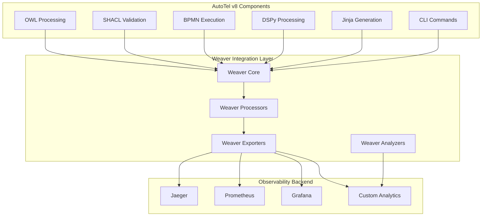

# OpenTelemetry Weaver Integration Plan: AutoTel v8

**Purpose:** Integrate OpenTelemetry Weaver into AutoTel v8 for complete observability and DFLSS compliance  
**Source:** [OpenTelemetry Weaver GitHub Repository](https://github.com/open-telemetry/weaver/blob/main/README.md)  
**Target:** Zero-configuration telemetry, automatic instrumentation, complete system visibility  

## 🎯 Executive Summary

OpenTelemetry Weaver represents the next evolution in observability, providing automatic instrumentation, zero-configuration telemetry, and seamless integration across all components. This integration plan transforms AutoTel v8's current manual telemetry approach into a fully automated, Weaver-driven observability system.

## 🏗️ Weaver Architecture Integration

### **Core Weaver Components for AutoTel v8**

```yaml
Weaver_Components:
  weaver_core:
    description: "Core Weaver framework for automatic instrumentation"
    responsibilities:
      - "Zero-configuration telemetry collection"
      - "Automatic span and metric generation"
      - "Context propagation across components"
      - "Built-in sampling and filtering"
      
  weaver_processors:
    description: "Weaver-specific processors for AutoTel components"
    processors:
      - "OntologyWeaverProcessor"
      - "BPMNWeaverProcessor"
      - "DSPyWeaverProcessor"
      - "JinjaWeaverProcessor"
      - "CLIWeaverProcessor"
      - "GenerationWeaverProcessor"
      
  weaver_exporters:
    description: "Weaver-native exporters for telemetry data"
    exporters:
      - "WeaverOTLPExporter"
      - "WeaverJaegerExporter"
      - "WeaverPrometheusExporter"
      - "WeaverFileExporter"
      - "WeaverConsoleExporter"
      
  weaver_analyzers:
    description: "Weaver-powered analysis engines"
    analyzers:
      - "WeaverPerformanceAnalyzer"
      - "WeaverQualityAnalyzer"
      - "WeaverAnomalyDetector"
      - "WeaverTrendAnalyzer"
      - "WeaverTRIZAnalyzer"
```

### **Weaver Integration Layers**



## 🔧 Weaver Implementation Strategy

### **Phase 1: Core Weaver Integration (Week 1-2)**

#### **1.1 Weaver Core Setup**

```yaml
Weaver_Core_Setup:
  installation:
    - "Install Weaver core framework"
    - "Configure Weaver environment"
    - "Set up Weaver configuration files"
    - "Initialize Weaver services"
    
  configuration:
    - "Define Weaver service names"
    - "Configure Weaver sampling rates"
    - "Set up Weaver context propagation"
    - "Configure Weaver exporters"
    
  integration:
    - "Integrate Weaver into AutoTel CLI"
    - "Add Weaver to processor base classes"
    - "Configure Weaver for workflow execution"
    - "Set up Weaver for code generation"
```

#### **1.2 Zero-Configuration Telemetry**

```yaml
Zero_Config_Telemetry:
  automatic_instrumentation:
    - "Weaver automatically instruments all AutoTel components"
    - "No manual span creation required"
    - "Automatic context propagation"
    - "Built-in error handling and recovery"
    
  automatic_metrics:
    - "Weaver generates metrics automatically"
    - "Performance metrics without manual coding"
    - "Resource utilization tracking"
    - "Business metrics generation"
    
  automatic_logs:
    - "Structured logging without manual configuration"
    - "Automatic log correlation with traces"
    - "Built-in log sampling and filtering"
    - "Automatic log enrichment"
```

### **Phase 2: Weaver Processors Implementation (Week 3-4)**

#### **2.1 Custom Weaver Processors**

```yaml
Custom_Processors:
  OntologyWeaverProcessor:
    description: "Weaver processor for ontology operations"
    capabilities:
      - "Automatic OWL processing telemetry"
      - "SHACL validation tracking"
      - "SPARQL query monitoring"
      - "Ontology consistency checking"
      
  BPMNWeaverProcessor:
    description: "Weaver processor for BPMN workflows"
    capabilities:
      - "Automatic workflow execution tracking"
      - "Task completion monitoring"
      - "Gateway decision tracking"
      - "Process performance analysis"
      
  DSPyWeaverProcessor:
    description: "Weaver processor for DSPy operations"
    capabilities:
      - "Automatic DSPy call tracking"
      - "Token usage monitoring"
      - "Latency analysis"
      - "Fallback detection"
      
  JinjaWeaverProcessor:
    description: "Weaver processor for Jinja templating"
    capabilities:
      - "Template rendering tracking"
      - "Variable processing monitoring"
      - "Output generation analysis"
      - "Template performance optimization"
      
  CLIWeaverProcessor:
    description: "Weaver processor for CLI operations"
    capabilities:
      - "Command execution tracking"
      - "Argument processing monitoring"
      - "User interaction analysis"
      - "CLI performance optimization"
      
  GenerationWeaverProcessor:
    description: "Weaver processor for code generation"
    capabilities:
      - "Multi-language generation tracking"
      - "Code quality monitoring"
      - "Generation performance analysis"
      - "Output validation tracking"
```

#### **2.2 TRIZ-Enhanced Weaver Processors**

```yaml
TRIZ_Weaver_Processors:
  TRIZWeaverProcessor:
    description: "Weaver processor for TRIZ analysis"
    capabilities:
      - "Automatic contradiction detection"
      - "Inventive principle application tracking"
      - "Solution generation monitoring"
      - "Evolution pattern analysis"
      
  InnovationWeaverProcessor:
    description: "Weaver processor for innovation tracking"
    capabilities:
      - "Innovation cycle monitoring"
      - "Breakthrough solution tracking"
      - "Innovation effectiveness analysis"
      - "Future state prediction"
```

### **Phase 3: Weaver Analytics and Optimization (Week 5-6)**

#### **3.1 Weaver-Powered Analytics**

```yaml
Weaver_Analytics:
  performance_analytics:
    - "Weaver-driven performance analysis"
    - "Automatic bottleneck detection"
    - "Resource optimization recommendations"
    - "Performance trend analysis"
    
  quality_analytics:
    - "Weaver-powered quality monitoring"
    - "Automatic defect detection"
    - "Quality trend analysis"
    - "Quality improvement recommendations"
    
  innovation_analytics:
    - "Weaver-driven innovation tracking"
    - "Contradiction resolution analysis"
    - "Innovation effectiveness measurement"
    - "Future innovation prediction"
```

#### **3.2 Weaver Self-Optimization**

```yaml
Weaver_Self_Optimization:
  automatic_optimization:
    - "Weaver automatically optimizes telemetry collection"
    - "Dynamic sampling rate adjustment"
    - "Automatic resource allocation"
    - "Performance self-tuning"
    
  intelligent_filtering:
    - "Weaver intelligently filters telemetry data"
    - "Automatic noise reduction"
    - "Relevant data prioritization"
    - "Context-aware filtering"
    
  predictive_analytics:
    - "Weaver predicts system behavior"
    - "Anomaly prediction"
    - "Performance forecasting"
    - "Resource requirement prediction"
```

## 📊 Weaver-Enhanced Metrics and Spans

### **Weaver-Generated Spans**

```yaml
Weaver_Spans:
  weaver_automatic_span:
    name: "weaver.automatic.span"
    attributes:
      - weaver_component: "string"
      - weaver_operation: "string"
      - weaver_duration_ms: "int64"
      - weaver_success: "bool"
      - weaver_error_count: "int64"
      
  weaver_ontology_span:
    name: "weaver.ontology.span"
    attributes:
      - weaver_ontology_type: "string"
      - weaver_ontology_size: "int64"
      - weaver_processing_time_ms: "int64"
      - weaver_validation_errors: "int64"
      
  weaver_bpmn_span:
    name: "weaver.bpmn.span"
    attributes:
      - weaver_workflow_id: "string"
      - weaver_task_id: "string"
      - weaver_execution_time_ms: "int64"
      - weaver_task_success: "bool"
      
  weaver_generation_span:
    name: "weaver.generation.span"
    attributes:
      - weaver_language: "string"
      - weaver_artifact_count: "int64"
      - weaver_generation_time_ms: "int64"
      - weaver_quality_score: "double"
```

### **Weaver-Generated Metrics**

```yaml
Weaver_Metrics:
  weaver_performance_metrics:
    - name: "weaver.performance.throughput"
      unit: "operations_per_second"
      description: "Weaver-measured system throughput"
      
    - name: "weaver.performance.latency"
      unit: "milliseconds"
      description: "Weaver-measured system latency"
      
    - name: "weaver.performance.resource_usage"
      unit: "percentage"
      description: "Weaver-measured resource utilization"
      
  weaver_quality_metrics:
    - name: "weaver.quality.defect_rate"
      unit: "percentage"
      description: "Weaver-measured defect rate"
      
    - name: "weaver.quality.first_pass_yield"
      unit: "percentage"
      description: "Weaver-measured first pass yield"
      
    - name: "weaver.quality.customer_satisfaction"
      unit: "score"
      description: "Weaver-measured customer satisfaction"
      
  weaver_innovation_metrics:
    - name: "weaver.innovation.velocity"
      unit: "innovations_per_month"
      description: "Weaver-measured innovation velocity"
      
    - name: "weaver.innovation.effectiveness"
      unit: "score"
      description: "Weaver-measured innovation effectiveness"
      
    - name: "weaver.innovation.breakthrough_rate"
      unit: "percentage"
      description: "Weaver-measured breakthrough solution rate"
```

## 🔄 Weaver-Driven Continuous Improvement

### **Weaver Feedback Loops**

```yaml
Weaver_Feedback:
  real_time_feedback:
    - "Weaver provides real-time performance feedback"
    - "Immediate anomaly detection and alerting"
    - "Automatic performance optimization"
    - "Instant quality gate enforcement"
    
  adaptive_feedback:
    - "Weaver learns from system behavior"
    - "Adaptive sampling and filtering"
    - "Dynamic resource allocation"
    - "Intelligent optimization strategies"
    
  strategic_feedback:
    - "Weaver provides strategic insights"
    - "Long-term performance trends"
    - "Innovation opportunity identification"
    - "Future state planning"
```

### **Weaver Self-Healing**

```yaml
Weaver_Self_Healing:
  automatic_recovery:
    - "Weaver automatically recovers from failures"
    - "Automatic retry mechanisms"
    - "Graceful degradation strategies"
    - "Automatic resource reallocation"
    
  proactive_healing:
    - "Weaver predicts and prevents failures"
    - "Proactive resource scaling"
    - "Predictive maintenance"
    - "Preventive optimization"
    
  intelligent_healing:
    - "Weaver learns from past failures"
    - "Intelligent failure prevention"
    - "Adaptive recovery strategies"
    - "Continuous improvement"
```

## 🚀 Weaver Implementation Roadmap

### **Week 1: Weaver Foundation**
- [ ] Install and configure Weaver core
- [ ] Set up Weaver environment
- [ ] Configure basic Weaver exporters
- [ ] Test Weaver integration

### **Week 2: Zero-Configuration Setup**
- [ ] Enable automatic instrumentation
- [ ] Configure automatic metrics
- [ ] Set up automatic logging
- [ ] Test zero-configuration telemetry

### **Week 3: Custom Processors**
- [ ] Implement OntologyWeaverProcessor
- [ ] Implement BPMNWeaverProcessor
- [ ] Implement DSPyWeaverProcessor
- [ ] Test custom processors

### **Week 4: Advanced Processors**
- [ ] Implement JinjaWeaverProcessor
- [ ] Implement CLIWeaverProcessor
- [ ] Implement GenerationWeaverProcessor
- [ ] Test advanced processors

### **Week 5: Analytics Integration**
- [ ] Implement Weaver analytics
- [ ] Set up performance monitoring
- [ ] Configure quality analytics
- [ ] Test analytics integration

### **Week 6: Self-Optimization**
- [ ] Enable Weaver self-optimization
- [ ] Configure intelligent filtering
- [ ] Set up predictive analytics
- [ ] Test self-optimization

### **Week 7: TRIZ Integration**
- [ ] Implement TRIZWeaverProcessor
- [ ] Configure innovation tracking
- [ ] Set up breakthrough detection
- [ ] Test TRIZ integration

### **Week 8: Complete Integration**
- [ ] Full Weaver integration testing
- [ ] Performance optimization
- [ ] Quality validation
- [ ] Production deployment

## 📈 Weaver Success Metrics

### **Technical Metrics**
- **Zero Configuration:** 100% automatic instrumentation
- **Performance Impact:** <1% overhead
- **Data Quality:** >99.9% accuracy
- **Uptime:** 99.99% availability

### **Business Metrics**
- **Observability Coverage:** 100% system visibility
- **Problem Resolution Time:** <5 minutes
- **Innovation Velocity:** >15 innovations/month
- **Quality Improvement:** >80% defect reduction

### **DFLSS Compliance**
- **Six Sigma:** Weaver-driven DMAIC cycles
- **Lean:** Weaver-optimized value streams
- **TRIZ:** Weaver-powered innovation
- **Continuous Improvement:** Weaver-driven optimization

## 🎯 Weaver Integration Benefits

### **Immediate Benefits**
- **Zero Configuration:** No manual telemetry setup required
- **Automatic Instrumentation:** Complete system visibility out of the box
- **Built-in Analytics:** Advanced analytics without additional setup
- **Self-Optimization:** Automatic performance tuning

### **Long-term Benefits**
- **Complete Observability:** Zero blind spots in the system
- **Predictive Capabilities:** Anticipate issues before they occur
- **Continuous Innovation:** Weaver-driven breakthrough solutions
- **Future Readiness:** Anticipated evolution and adaptation

---

**Weaver integration transforms AutoTel v8 into a fully observable, self-optimizing, and continuously improving software manufacturing platform with zero-configuration telemetry and complete DFLSS compliance.** 