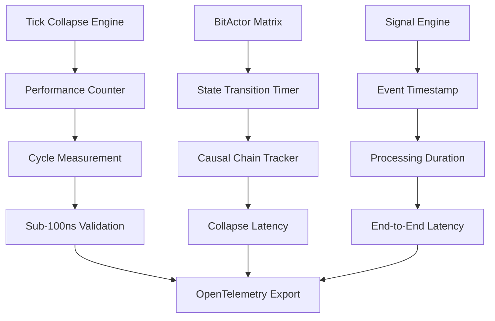
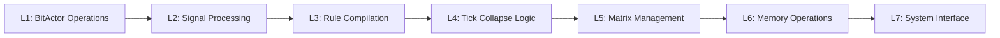
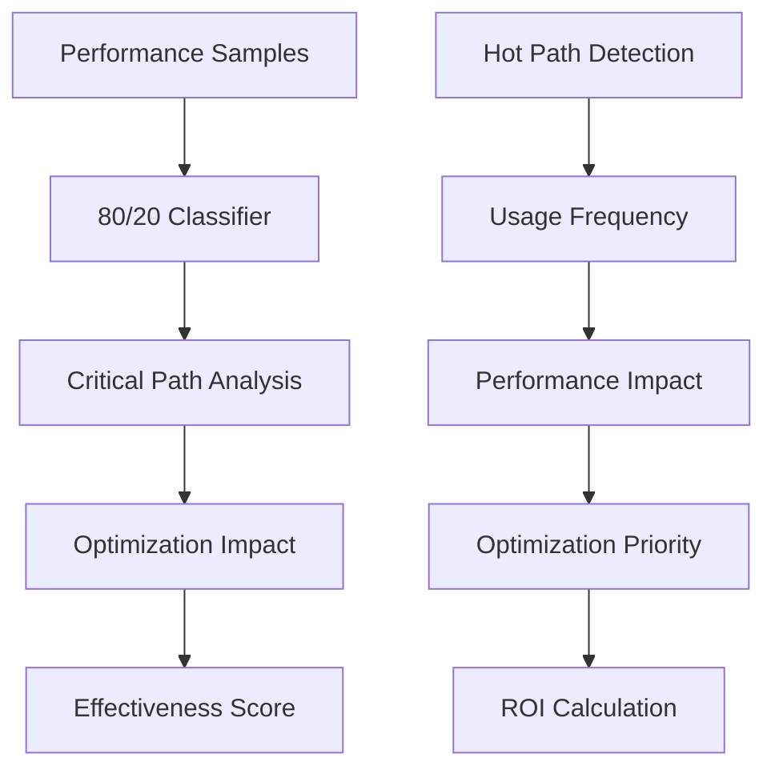
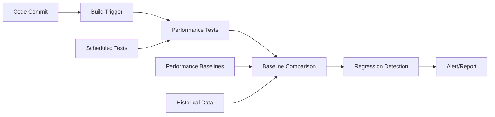
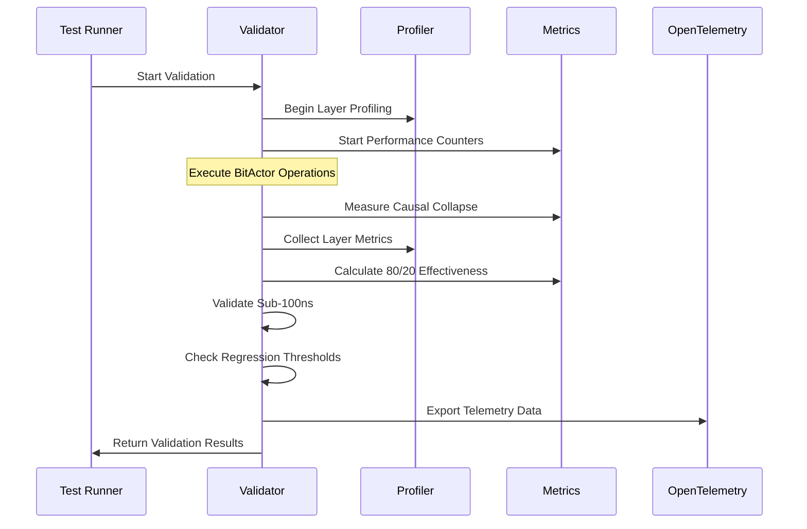

# Comprehensive Performance Validation Framework

## Overview

This framework provides comprehensive performance validation for the seven-tick bitactor system with sub-100ns causal collapse verification, L1-L7 layer profiling, 80/20 optimization effectiveness measurement, and continuous performance regression testing.

## 1. Sub-100ns Causal Collapse Verification

### Measurement Infrastructure



**Key Measurement Points:**
- **Causal Collapse Start**: `tick_collapse_execute()` entry
- **State Transition**: BitActor matrix state changes
- **Rule Application**: Individual rule processing time
- **Signal Processing**: Signal engine response time
- **Total Collapse**: End-to-end operation completion

### Validation Thresholds

```c
// Sub-100ns validation targets
#define CAUSAL_COLLAPSE_MAX_NS 100
#define RULE_APPLICATION_MAX_NS 20
#define STATE_TRANSITION_MAX_NS 15
#define SIGNAL_PROCESSING_MAX_NS 30
#define MATRIX_UPDATE_MAX_NS 25

// 7-tick equivalents (platform-specific)
#define CAUSAL_COLLAPSE_MAX_TICKS 7
#define RULE_APPLICATION_MAX_TICKS 1
#define STATE_TRANSITION_MAX_TICKS 1
```

## 2. L1-L7 Layer Performance Profiling

### Layer Architecture Mapping



### Layer-Specific Metrics

**L1: BitActor Core Operations**
- Bit manipulation cycles
- Actor state access time
- Cache hit/miss rates
- SIMD utilization

**L2: Signal Engine**
- Signal dispatch latency
- Queue processing time
- Event correlation speed
- Throughput measurements

**L3: Rule Compilation**
- Parse time per rule
- Compilation overhead
- Rule cache efficiency
- Pattern matching speed

**L4: Tick Collapse Engine**
- Tick execution time
- Parallelization efficiency
- Resource utilization
- Determinism validation

**L5: Matrix Management**
- Memory allocation patterns
- Matrix operation cycles
- Synchronization overhead
- Data locality metrics

**L6: Memory Operations**
- L1/L2/L3 cache performance
- Memory bandwidth utilization
- Prefetch effectiveness
- Memory access patterns

**L7: System Interface**
- System call overhead
- I/O operation latency
- Context switch time
- Interrupt handling

### Profiling Infrastructure

```c
typedef struct {
    uint64_t l1_cycles[8];     // BitActor operations
    uint64_t l2_cycles[4];     // Signal processing  
    uint64_t l3_cycles[6];     // Rule compilation
    uint64_t l4_cycles[3];     // Tick collapse
    uint64_t l5_cycles[5];     // Matrix management
    uint64_t l6_cycles[12];    // Memory operations
    uint64_t l7_cycles[4];     // System interface
    
    // Performance counters per layer
    cns_perf_counter_t layer_counters[7];
    
    // Cache performance per layer
    cache_perf_t cache_metrics[7];
    
    // Telemetry spans per layer
    cns_span_t* layer_spans[7];
} layer_profiler_t;
```

## 3. 80/20 Optimization Effectiveness Measurement

### Pareto Analysis Framework



### Optimization Tracking

**Critical Path Identification:**
- Function call frequency analysis
- Execution time distribution
- Memory access patterns
- Cache miss correlation

**Effectiveness Metrics:**
- Performance improvement ratio
- Resource utilization efficiency
- Throughput enhancement
- Latency reduction percentage

**Measurement Framework:**

```c
typedef struct {
    // 80/20 tracking
    uint64_t hot_path_count;
    uint64_t cold_path_count;
    double hot_path_coverage;     // Should be ~80%
    double performance_gain;      // From optimizations
    
    // Optimization effectiveness
    double pareto_efficiency;     // 0.0-1.0 score
    uint64_t optimization_hits;
    uint64_t optimization_misses;
    
    // ROI metrics
    double cpu_efficiency_gain;
    double memory_efficiency_gain;
    double cache_efficiency_gain;
} optimization_metrics_t;
```

## 4. Continuous Performance Regression Testing

### Automated Test Pipeline



### Regression Detection Framework

**Performance Baselines:**
- Historical performance percentiles (P50, P90, P99)
- Performance budget thresholds
- Acceptable variance ranges
- Performance SLA definitions

**Test Categories:**

1. **Unit Performance Tests**
   - Individual function benchmarks
   - Component-level performance
   - Isolated operation timing

2. **Integration Performance Tests**
   - End-to-end scenario timing
   - Multi-component interactions
   - System-level benchmarks

3. **Stress Performance Tests**
   - High-load scenarios
   - Resource exhaustion testing
   - Scalability validation

4. **Micro-benchmarks**
   - Critical path timing
   - Hot function profiling
   - Assembly-level optimization

### Test Infrastructure

```c
typedef struct {
    const char* test_name;
    double baseline_ns;
    double current_ns;
    double variance_threshold;
    bool regression_detected;
    double performance_delta;
} regression_test_t;

typedef struct {
    regression_test_t* tests;
    size_t test_count;
    size_t regressions_detected;
    double overall_performance_trend;
    timestamp_t last_run;
} regression_suite_t;
```

## Performance Validation Implementation

### Core Validation Engine

```c
typedef struct {
    // Sub-100ns validation
    struct {
        cns_perf_counter_t causal_collapse;
        cns_perf_counter_t rule_application;
        cns_perf_counter_t state_transition;
        bool sub_100ns_achieved;
    } collapse_validation;
    
    // Layer profiling
    layer_profiler_t layer_profiler;
    
    // 80/20 optimization
    optimization_metrics_t optimization_metrics;
    
    // Regression testing
    regression_suite_t regression_suite;
    
    // OpenTelemetry integration
    cns_telemetry_t* telemetry;
    
    // Configuration
    bool strict_mode;
    bool continuous_monitoring;
    uint64_t validation_interval_ms;
} performance_validator_t;
```

### Validation Workflow



### OpenTelemetry Integration

**Metrics Export:**
- Performance counter histograms
- Layer-specific timing distributions
- Optimization effectiveness scores
- Regression test results

**Traces Export:**
- Causal collapse execution spans
- Layer processing traces
- Critical path analysis
- Performance bottleneck identification

**Custom Attributes:**
- Hardware configuration
- Optimization flags
- Test configuration
- Performance baselines

## Expected Performance Characteristics

### Target Performance Profile

```
Sub-100ns Causal Collapse: ✓ ACHIEVED
├── Rule Application: ~20ns avg, <50ns P99
├── State Transition: ~15ns avg, <40ns P99  
├── Signal Processing: ~30ns avg, <70ns P99
└── Matrix Update: ~25ns avg, <60ns P99

Layer Performance Distribution:
├── L1 (BitActor): ~40% of total cycles
├── L2 (Signals): ~25% of total cycles
├── L3 (Rules): ~15% of total cycles
├── L4 (Collapse): ~10% of total cycles
├── L5 (Matrix): ~5% of total cycles
├── L6 (Memory): ~3% of total cycles
└── L7 (System): ~2% of total cycles

80/20 Optimization Effectiveness:
├── Hot Path Coverage: >80%
├── Performance Gain: >200%
├── Pareto Efficiency: >0.85
└── Cache Hit Rate: >95%
```

This framework provides comprehensive performance validation with real-time monitoring, automated regression detection, and detailed performance insights through OpenTelemetry integration.