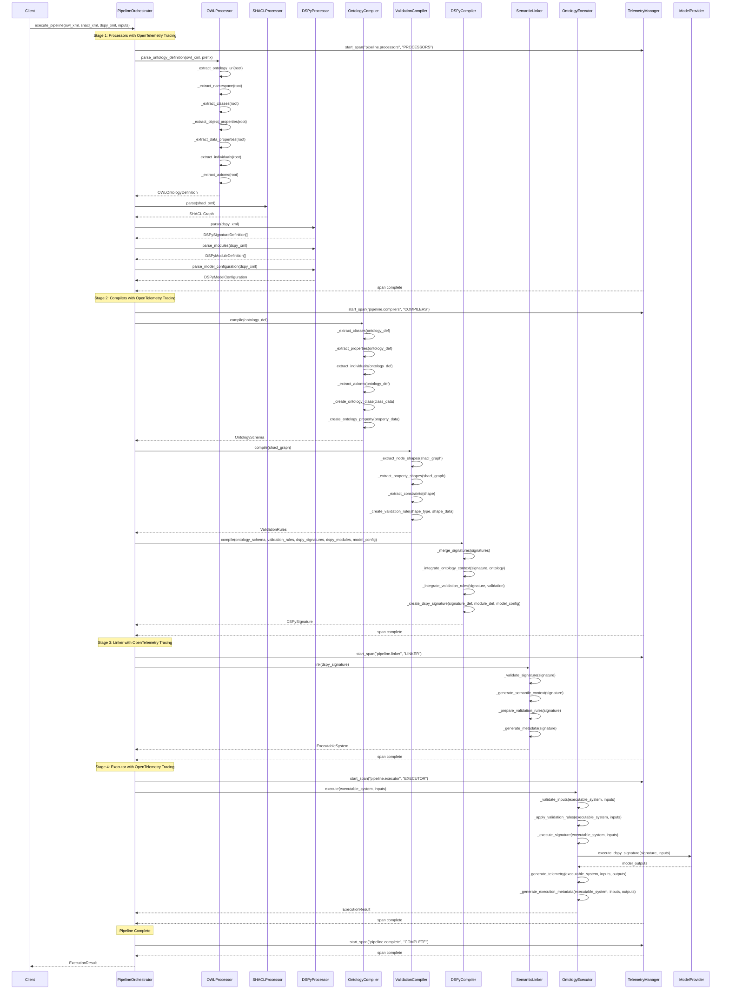
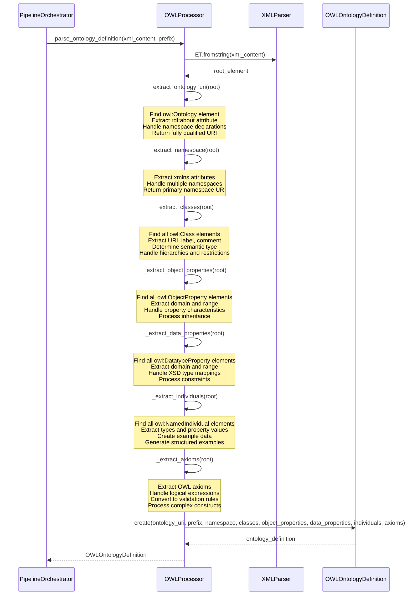
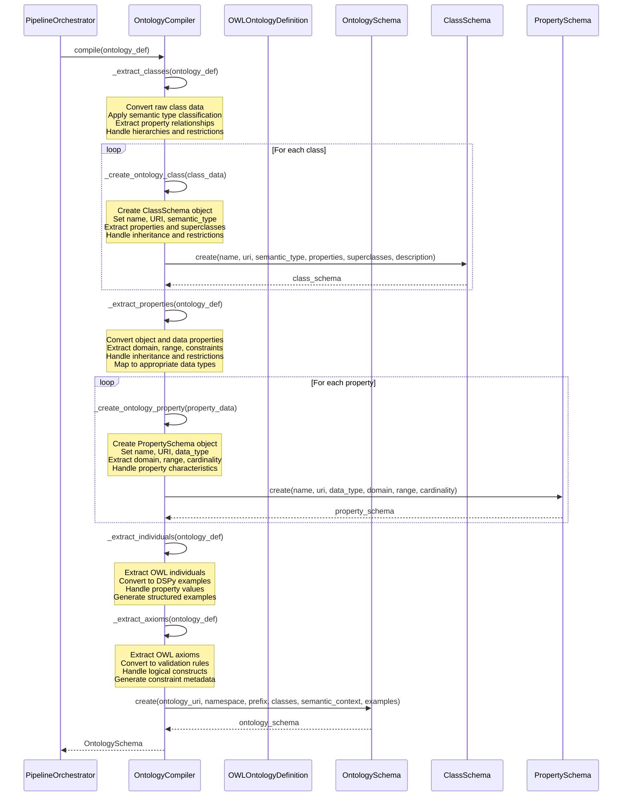
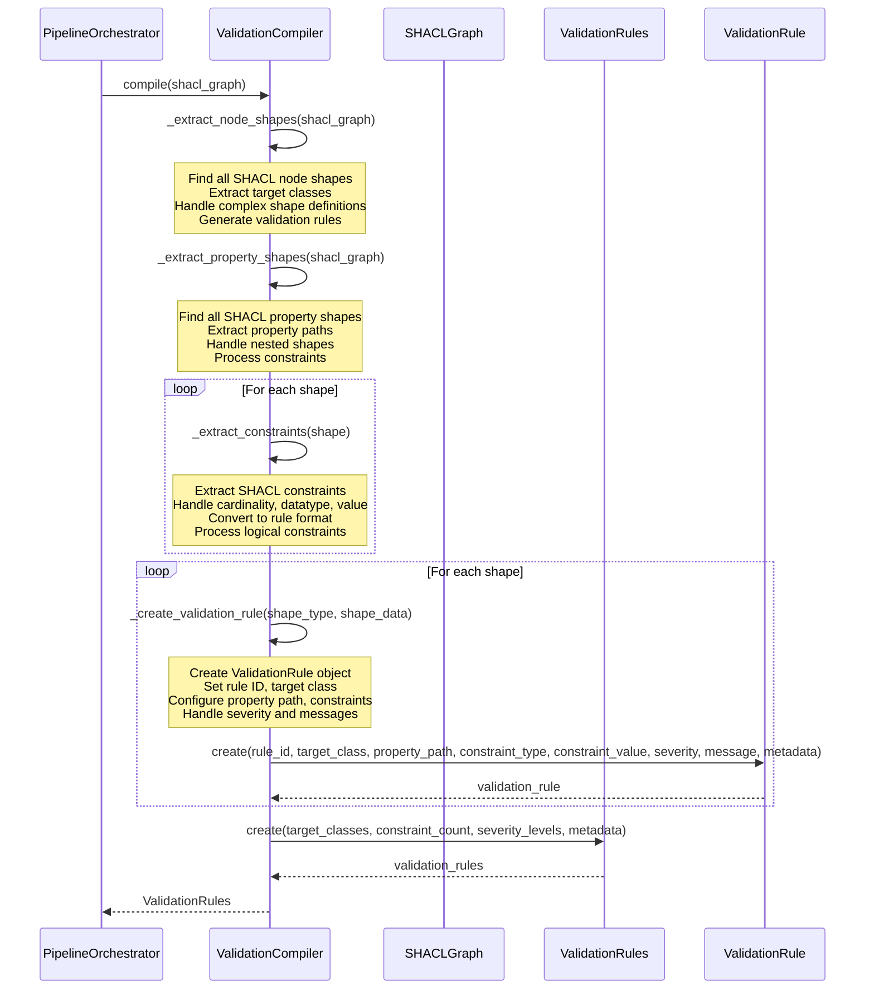
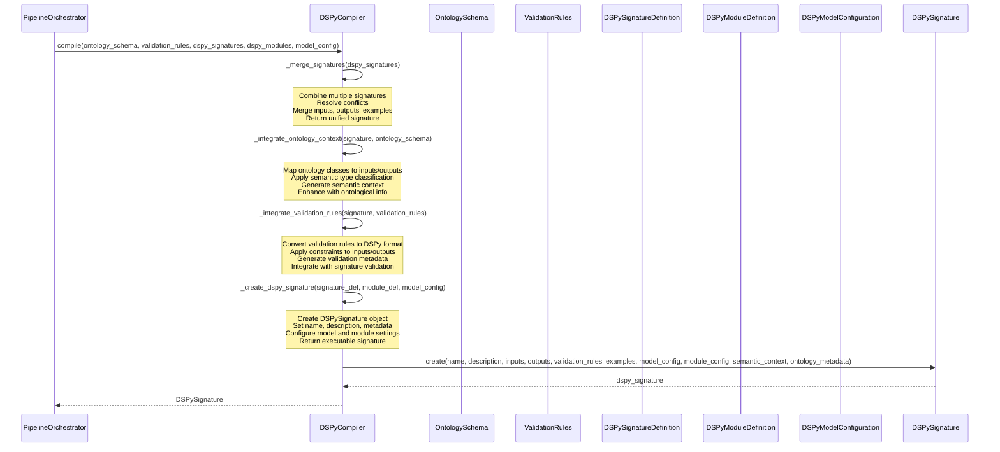
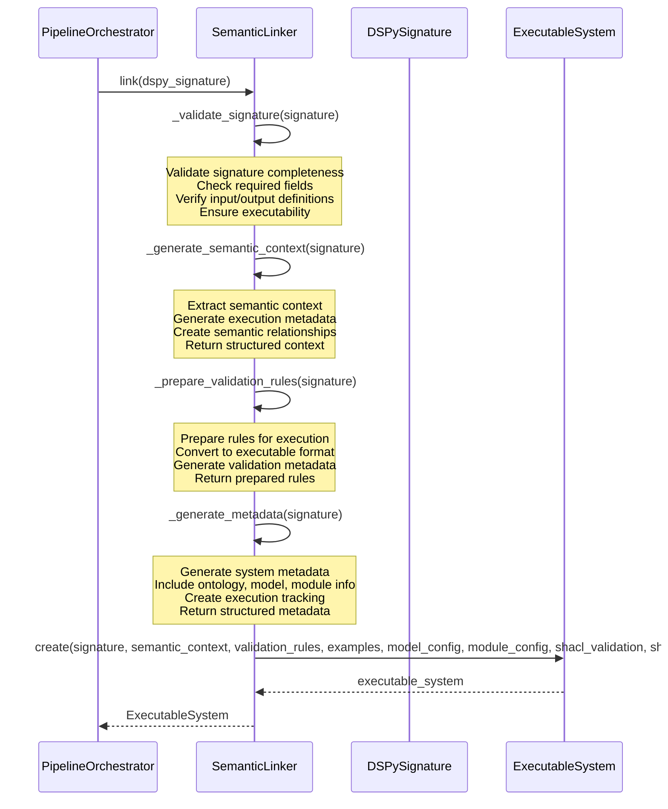
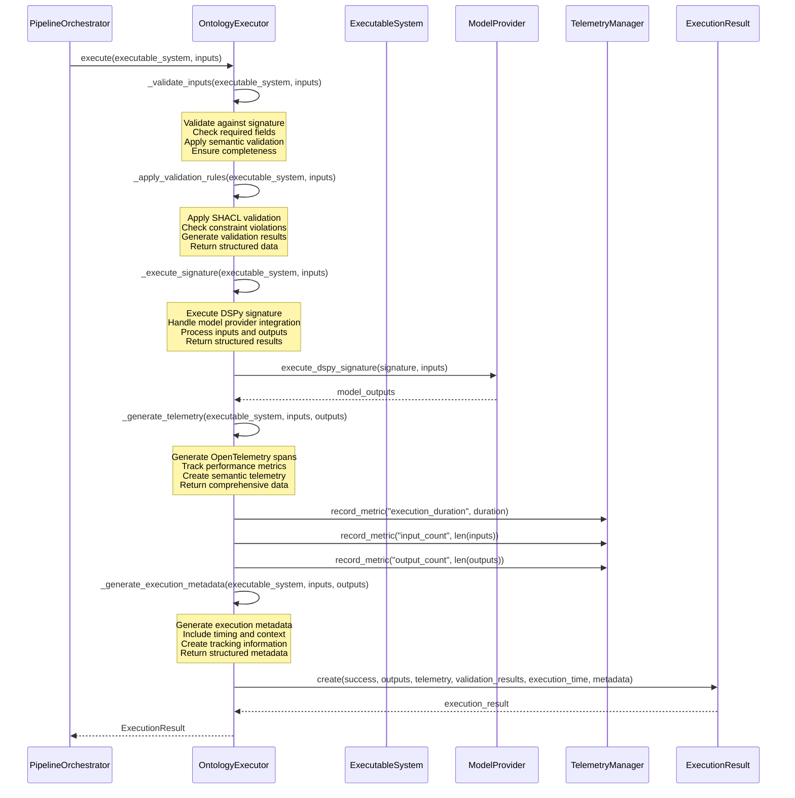
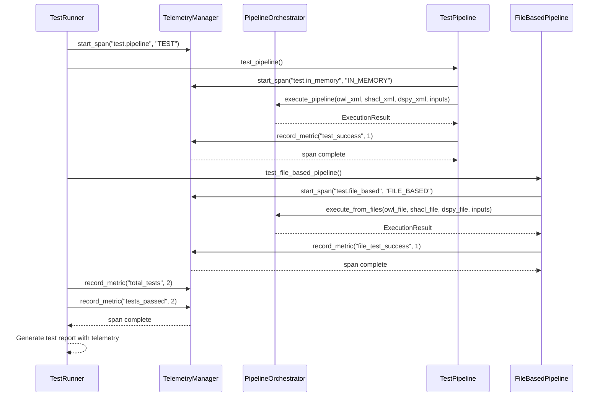
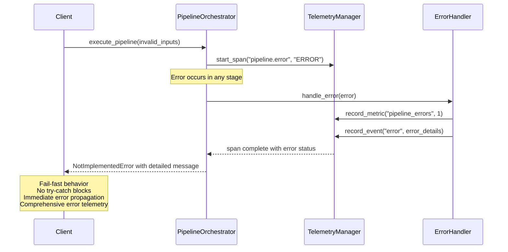

# AutoTel Pipeline Sequence Diagrams

## Complete Pipeline Execution Sequence

## OWL Processor Detailed Sequence

## Ontology Compiler Detailed Sequence

## Validation Compiler Detailed Sequence

## DSPy Compiler Detailed Sequence

## Semantic Linker Detailed Sequence

## Ontology Executor Detailed Sequence

## Test Pipeline Sequence

## Error Handling Sequence

## Data Flow Summary

### Input Data Flow
1. **OWL XML** → OWLProcessor → OWLOntologyDefinition → OntologyCompiler → OntologySchema
2. **SHACL XML** → SHACLProcessor → SHACL Graph → ValidationCompiler → ValidationRules
3. **DSPy XML** → DSPyProcessor → DSPySignatureDefinition[] → DSPyCompiler → DSPySignature

### Integration Flow
1. **OntologySchema + ValidationRules + DSPySignature** → DSPyCompiler → Integrated DSPySignature
2. **Integrated DSPySignature** → SemanticLinker → ExecutableSystem
3. **ExecutableSystem + Inputs** → OntologyExecutor → ExecutionResult

### Telemetry Flow
1. **Pipeline Stages** → TelemetryManager → OpenTelemetry Spans
2. **Validation Results** → TelemetryManager → Validation Events
3. **Execution Metrics** → TelemetryManager → Performance Metrics
4. **Error Events** → TelemetryManager → Error Tracking

### Output Data Flow
1. **ExecutionResult** → Client (success/failure, outputs, telemetry, validation, metadata)
2. **Telemetry Data** → OpenTelemetry Backend (spans, events, metrics)
3. **Validation Results** → Client (constraint violations, warnings, info)
4. **Metadata** → Client (execution context, performance data, semantic information) 